# OpenCode 技术架构深度解析

> 技术分享文档 · 2026-06-16
> 代码基准 · 分支 `dev` · commit `0f8dec8a4` · 包版本 `opencode@1.17.7`
> 图表使用 PlantUML，通过自托管 [Kroki](https://kroki.thetamind.ai/) 生成 SVG（复制链接到浏览器打开）

---

## 阅读地图

| 层次 | 章节 | 关注点 |
|------|------|--------|
| 概览 | §1 技术选型 · §2 心智模型 · §3 系统上下文 | 建立全局认知，理解为什么这么选 |
| 结构 | §4 包拓扑 · §5 运行时分层 · §6 HTTP 路由 | 模块边界、依赖方向、路由映射 |
| 核心 | §7 双执行栈 · §8 Coordinator · §9 Provider Turn | V1/V2 对比、调度策略、单 turn 模型 |
| 持久化 | §10 EventV2 · §11 LocationServiceMap | 事件溯源、服务隔离与生命周期 |
| 能力 | §12 工具系统 · §13 子 Agent · §14-15 Context/Compaction | 工具权限、Agent 编排、上下文管理 |
| 补充 | §16-22 Agent/LLM/Plugin/性能/索引/演进 | 按需查阅 |

> **如果时间有限：** 重点看 §2（心智模型）→ §7（双执行栈）→ §10（EventV2）→ §14（Context Epoch），这四节串起了整个系统的核心设计逻辑。

---

## 1. 项目定位与技术选型

OpenCode 是一个开源 AI 编程 Agent，定位为本地运行的多模态编程助手。它不是简单的 LLM Chat 封装，而是一个具备**持久化会话引擎、工具执行框架、多 Provider 路由、权限模型**的完整 Agent 系统。

### 核心技术栈

| 层次 | 选型 | 设计原因 |
|------|------|---------|
| 运行时 | **Bun** | 原生 SQLite 绑定、快速启动、TypeScript 一等公民 |
| 类型系统 | **Effect** (v4 beta) | 代替传统 DI 容器，提供类型安全的依赖注入、资源管理、并发控制 |
| 数据库 | **SQLite + Drizzle ORM** | 嵌入式、零配置、事务性事件存储 |
| LLM 集成 | **Vercel AI SDK** (V1) + 自研协议层 (V2) | V1 用成熟生态快速支撑交互，V2 走自研 route 实现精细控制 |
| 前端 | **SolidJS** | TUI (OpenTUI) 和 Web App 共享同一响应式框架 |
| 工程 | **Turborepo + Bun Workspaces** | Monorepo 多包协作，增量构建 |

### 为什么是 Effect？

这是理解整个代码库的关键。OpenCode 不用 NestJS 式的 IoC 容器，而是选择了函数式的 Effect 系统。所有服务通过 `Context.Service` 声明接口，通过 `Layer` 组装依赖图。这带来了三个核心优势：

1. **类型安全的依赖声明** —— 编译期确认所有服务依赖是否满足
2. **资源安全** —— `Layer` 自动管理生命周期（创建/销毁），不需要手动 dispose
3. **可测试性** —— 替换任何一层 Layer 就能注入 mock，无需 monkey-patch

```typescript
// 示例：声明一个服务接口
export class Service extends Context.Service<Service, Interface>()("@opencode/v2/ToolRegistry") {}

// 通过 Layer 组装
const registryLayer = Layer.effect(Service, Effect.gen(function* () {
  const applications = yield* ApplicationTools.Service  // 自动注入依赖
  // ...
  return Service.of({ materialize, register })
}))
```

---

## 2. 心智模型：双栈双 API

理解 OpenCode 的第一步是建立正确的心智模型。当前代码态的关键事实：同一 HTTP Server（默认 `:4096`）上**并存两套 Session 执行栈 + 两套 HTTP API**。

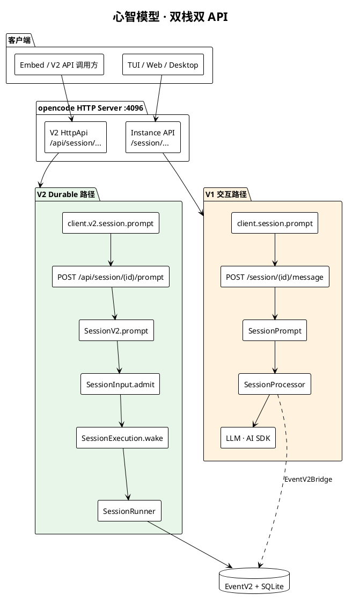

**架构约束（读源码时的锚点）：**

| 约束 | 含义 |
|------|------|
| 准入 ≠ 执行（V2） | `SessionInput.admit` 写 durable inbox；`SessionExecution.wake` 异步调度 |
| 每 Session 一条 drain | `SessionRunCoordinator` 合并 wake、处理 interrupt 边界 |
| 每 turn 一次 LLM（V2） | `SessionRunner.runTurnAttempt` 只调一次 `llm.stream` |
| Location 作用域 | Runner / Tools / Config 按项目目录隔离 |
| 进程全局 | `SessionStore` / `SessionExecution` / `EventV2` 仅按 sessionID 路由 |
| 子 Agent | `task` 工具 + `parentID` 子 Session，非独立 Runner 类型 |

---

## 3. 系统上下文（C4 Context）

从 C4 视角看 OpenCode 的外部边界：

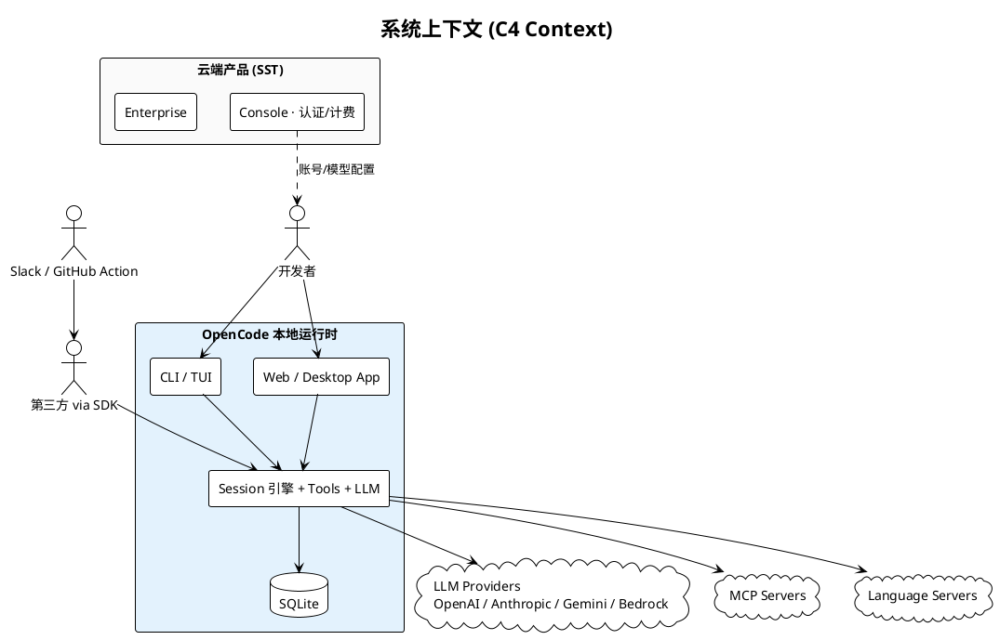

**边界说明：**

- UI 层（`tui` / `app` / `desktop`）**只通过 `@opencode-ai/sdk` 访问 HTTP**，不 import `@opencode-ai/core`
- `@opencode-ai/server` 是**路由契约 + handlers 包**，handlers 挂载在 opencode 进程内，不是独立微服务
- Cloud 包与本地引擎解耦，本地 `opencode serve` 可完全离线运行

---

## 4. Monorepo 包拓扑

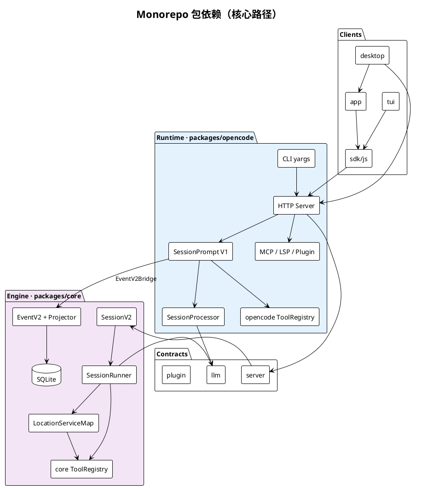

| 包 | 职责 |
|----|------|
| `opencode` | CLI、HTTP Server、Instance Bootstrap、V1 Session 编排 |
| `@opencode-ai/core` | V2 Session、EventV2、Location 层、Drizzle/SQLite |
| `@opencode-ai/server` | HttpApi 路由定义 + V2 handlers（`/api/*`） |
| `@opencode-ai/llm` | Effect Schema LLM 协议、Provider 路由 |
| `@opencode-ai/sdk` | 生成的 HTTP 客户端（Instance + V2 双 surface） |
| `tui` / `app` / `desktop` | UI，SDK-only 边界 |

---

## 5. 运行时分层

七层模型：**由外向内，职责逐层收窄**。

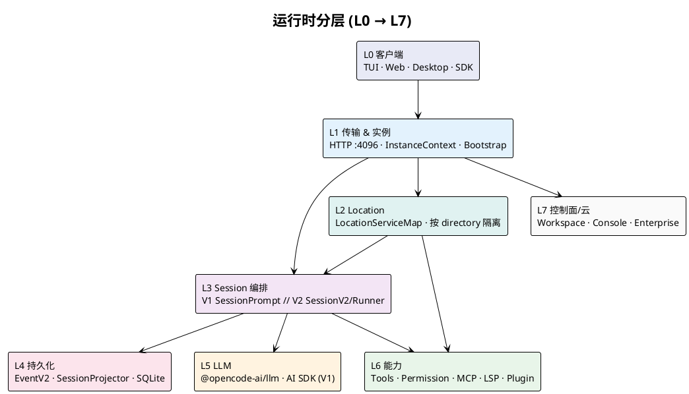

**L1 Instance 层要点：**
- 请求通过 `x-opencode-directory` 或 `?directory=` 绑定项目目录
- `InstanceBootstrap` 启动：Config、Plugins、LSP、VCS、Snapshot、Format
- `InstanceState` / `InstanceStore` 按目录缓存服务实例

**L2 vs L3 作用域分裂（V2 设计核心）：**

| 作用域 | 组件 | 设计意图 |
|--------|------|---------|
| 进程全局 | SessionStore, SessionExecution, EventV2 | 仅持有 sessionID，便于跨 Location 路由 |
| Location | SessionRunner, ToolRegistry, AgentV2, Config | 与 filesystem / 权限 / 工具绑定 |

---

## 6. HTTP Server 路由与实例模型

opencode 在**单个进程**内组装多棵路由树：

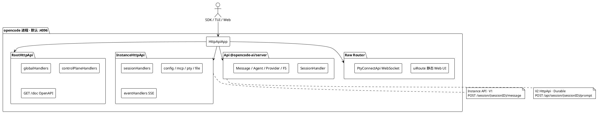

**SDK 与路由的精确映射：**

| SDK 调用 | HTTP | 执行栈 |
|----------|------|--------|
| `client.session.prompt({ parts, agent, model })` | `POST /session/{id}/message` | V1 |
| `client.session.promptAsync(...)` | `POST /session/{id}/prompt_async` | V1 异步 |
| `client.v2.session.prompt({ prompt, delivery })` | `POST /api/session/{id}/prompt` | V2 |

---

## 7. 双执行栈详解

这是理解整个项目 **migration 现状** 的核心章节。

### 7.1 汇合点：EventV2 + SQLite

两条路径最终汇聚到同一个事件存储：

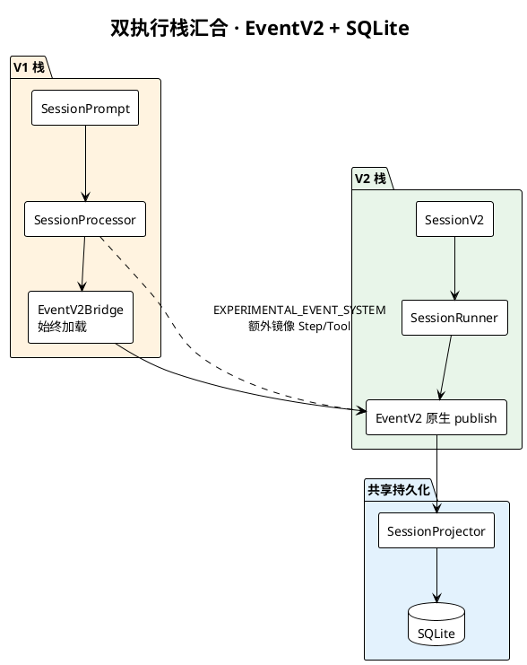

**EventV2Bridge 职责澄清：**
- **始终加载**（`app-runtime.ts`）：为 `EventV2.publish` 自动注入 Instance `location`；转发到 `GlobalBus`
- **`OPENCODE_EXPERIMENTAL_EVENT_SYSTEM`**：控制 V1 `SessionProcessor` **是否额外镜像** Step/Tool 到 EventV2，不是 Bridge 开关

### 7.2 V1 交互路径（完整时序）

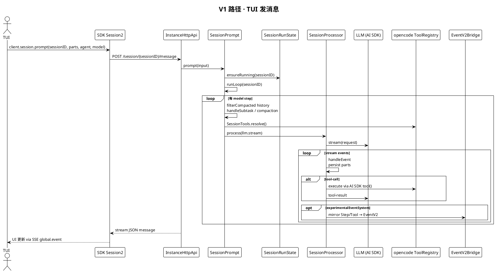

**V1 特征：**
- 内存循环 `SessionPrompt.runLoop`，工具在 Processor 内 inline settle
- 子 Agent（`task` 工具）对子 Session 递归调用**同一 V1 路径**
- Compaction / Revert / Share 等能力仍在 V1 HTTP surface

### 7.3 V2 Durable 路径：Prompt 准入 → 调度

V2 的核心设计理念：**准入（Admission）与执行（Execution）分离**。

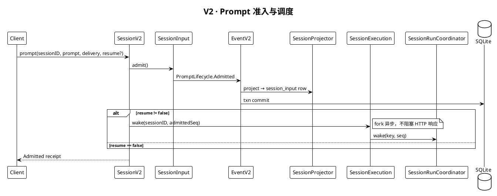

这意味着：
1. **快速确认** —— 客户端发送 prompt 后立即得到 Admitted 回执
2. **不丢消息** —— 即使进程 crash，已 admit 的输入已落盘（event row + session_input）
3. **可恢复执行** —— 重启后从 durable inbox 恢复未完成的工作
4. **集群扩展** —— 未来可由任何节点领取执行权（当前为单进程 local）

### 7.4 Delivery 语义

| 模式 | 行为 |
|------|------|
| `steer`（默认） | 合并进当前 activity；在下一 **safe provider-turn boundary** 由 Runner `promoteSteers` |
| `queue` | FIFO；当前 activity 结束后 `promoteNextQueued` 开新 activity |

`session_input` 是 durable inbox；**Promoted 之前对模型不可见**。

### 7.5 V2 端到端数据流

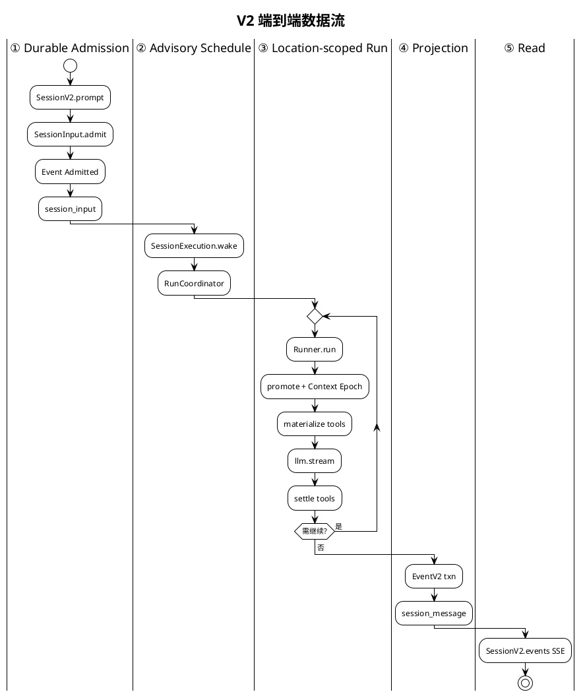

---

## 8. SessionRunCoordinator 状态机

进程内**每个 Session ID 最多一条 active drain chain**；不同 Session 可并发 drain。

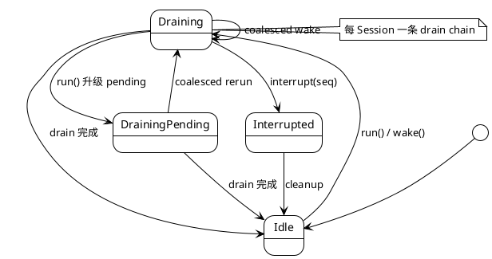

| 操作 | 语义 |
|------|------|
| `run(sessionID)` | 显式 drain；加入当前 chain 或启动新 chain |
| `wake(sessionID, seq?)` | advisory；idle 时启动，draining 时 coalesce 为一次 pending rerun |
| `interrupt(sessionID, seq?)` | 停止 active fiber；suppress interrupt 边界前的 stale wake |
| `resume(sessionID)` | 等价于 force run，处理 durable inbox 中 pending 工作 |

核心实现逻辑：

```typescript
// packages/core/src/session/run-coordinator.ts
type Demand = { readonly _tag: "run" } | { readonly _tag: "wake"; readonly seq?: number }

// 合并策略：run 语义强于 wake
const coalesce = (left: Demand | undefined, right: Demand): Demand => {
  if (left?._tag === "run" || right._tag === "run") return { _tag: "run" }
  return { _tag: "wake", seq: maxSeq(left?.seq, right.seq) }
}
```

这个设计保证了：
- 即使并发收到多个 wake 信号，也只会执行一次 drain，避免重复工作
- explicit run 不会被 advisory wake 降级
- interrupt 能干净地停止执行并抑制过期的 wake

实现：`packages/core/src/session/execution/local.ts` → `SessionRunCoordinator` → `SessionRunner.run({ force? })`

---

## 9. SessionRunner · 单次 Provider Turn

V2 与 V1 的根本差异：**每 turn 恰好一次 `llm.stream`**，工具在 stream handler 内 eager fiber settle，turn 结束前 await 全部 fibers。

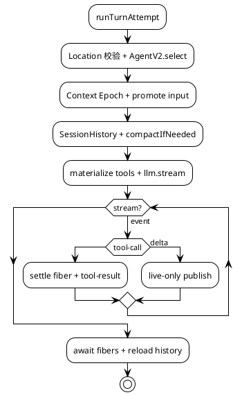

**硬限制与边界行为：**

| 项 | 值 / 行为 |
|----|----------|
| `MAX_STEPS` | 25 provider turns / drain |
| Location 迁移 | Session 已 move 到其他 Location → interrupt |
| 中断工具 | 上次 crash 遗留 `running` 工具 → `Tool execution interrupted` |
| Overflow | `compactAfterOverflow` 最多重建一次 logical turn |

---

## 10. EventV2 事件溯源

### 10.1 两类事件

| 类型 | 持久化 | 投影 | 回放 | 示例 |
|------|--------|------|------|------|
| Sync | ✅ | ✅ DB 事务内 | ✅ | Admitted, Promoted, Tool.Success |
| Live-only | ❌ | ❌ | ❌ | Text.Delta, Reasoning.Delta |

### 10.2 同步事件提交管道

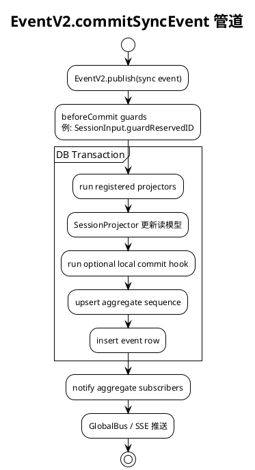

### 10.3 事件定义机制

```typescript
// packages/core/src/event.ts
export function define<const Type extends string, Fields extends Schema.Struct.Fields>(input: {
  readonly type: Type
  readonly sync?: { readonly version: number; readonly aggregate: string }
  readonly data: Schema.Struct<Fields>
}): Definition<Type, Schema.Struct<Fields>>
```

### 10.4 Session 事件词汇

| 事件 | 投影目标 | 含义 |
|------|---------|------|
| `PromptLifecycle.Admitted` | `session_input` inbox row | 用户输入已录入 inbox |
| `PromptLifecycle.Promoted` | 可见 user `session_message` | 输入已提升为模型可见 |
| `Step.Started/Ended` | assistant turn 边界 | 一个 provider turn 的起止 |
| `Text.*` / `Reasoning.*` | message parts | 文本/推理增量 |
| `Tool.Input/Called/Success/Failed` | tool parts + 状态 | 工具调用全生命周期 |
| `ContextUpdated` | Context Epoch 推进 | 系统上下文变化 |
| `Compaction.started/ended` | 压缩 checkpoint | 历史压缩 |
| `InterruptRequested` | 中断信号 | 用户取消 |

### 10.5 为什么选择事件溯源？

1. **可恢复性** —— Session 崩溃后从最后一个 committed event 恢复，不丢失已完成的工具执行
2. **读写分离** —— Projector 将事件投影为 `session_message` 读模型，查询无需回放全量事件
3. **审计性** —— 完整的事件序列是不可变日志，支持调试和 replay
4. **SSE 推送** —— 客户端通过 `after` cursor 获取增量事件，天然支持实时更新
5. **版本演进** —— 事件有 version 字段，Projector 可兼容处理旧事件

---

## 11. LocationServiceMap

打开项目目录时 boot 的 Effect Layer 集合，**Idle TTL 60 分钟**。

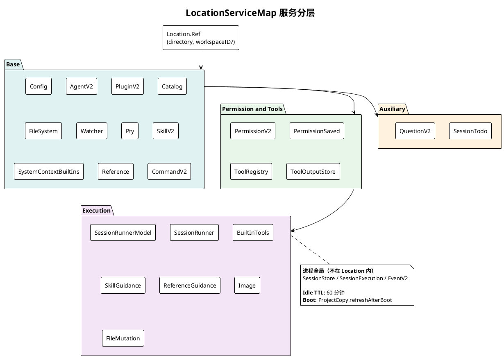

**路由链：**

```
SessionExecution.wake(sessionID)
  → SessionStore.get(sessionID) → location
  → LocationServiceMap.get(location)
  → SessionRunner.run({ sessionID, force: false })
```

**wake vs resume：** `wake` 是 advisory（force=false），idle 时启动，draining 时 coalesce；`resume` 是 explicit drain（force=true）。

---

## 12. 工具注册与权限

### 12.1 双 Registry

| | V1 (`opencode`) | V2 (`core`) |
|---|----------------|------------|
| 形态 | AI SDK `tool()` 包装 | `Tool.make` + Effect execute |
| 解析 | `SessionTools.resolve` | `ToolRegistry.materialize` |
| 执行 | Processor inline | `settle()` fiber + `permission.assert` |

### 12.2 V2 工具生命周期

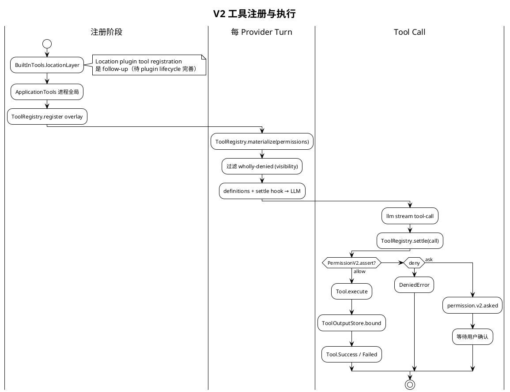

**权限规则合并：** Agent 默认 ruleset + Session `PermissionSaved` + Subagent 继承；**最后匹配的 wildcard 规则胜出**；默认 effect 为 `ask`。

### 12.3 工具输出边界化

工具执行结果可能很大。三层处理：

1. **工具自身裁剪** —— tool-specific 策略
2. **ToolOutputStore.bound** —— 统一大小限制（行数或 UTF-8 字节数，先到者为准）
3. **Managed Tool Output File** —— 超大输出写入临时文件，模型只看到有界预览 + 路径

### 12.4 内置工具

| 工具 | 能力 | 权限默认 |
|------|------|---------|
| `bash` | 执行 shell 命令 | ask |
| `edit` | 文件精确替换 | ask |
| `write` | 创建/覆盖文件 | ask |
| `read` | 读取文件内容 | allow |
| `glob` | 文件模式匹配 | allow |
| `grep` | 内容搜索 (ripgrep) | allow |
| `task` | 启动子 Agent | allow |
| `webfetch` | HTTP 请求 | ask |
| `websearch` | Web 搜索 | ask |

---

## 13. 子 Agent（task 工具）

Subagent **不是**独立 Runner 类型，而是 `parentID` 关联的普通 Session。

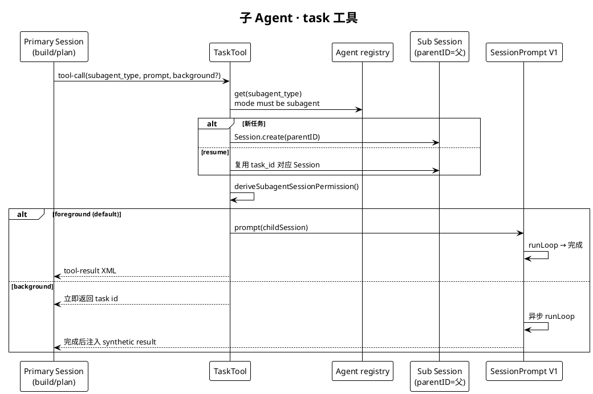

| subagent | mode | 能力概要 |
|----------|------|---------|
| `general` | subagent | 多步研究；deny todowrite |
| `explore` | subagent | 只读探索；deny edit/bash 等 |

**并发限制：** 最多 4 个 subagent 并发执行（`TaskSemaphore`）。

---

## 14. Context Epoch

V2 Session 持久化**模型可见的特权系统上下文**（与 user/assistant 消息分离）。

它解决了一个真实问题：**AI Agent 运行过程中，系统上下文（日期、项目配置、AGENTS.md、Skill 列表）可能变化，如何持久化地、一致地向模型传递这些变化？**

### 14.1 核心概念

- **Context Source**：独立类型化上下文值（稳定 key + codec + loader + renderers）
- **Context Epoch**：一段 baseline 不可变的时间跨度
- **Baseline**：Epoch 开始时渲染的完整系统上下文
- **Mid-Conversation System Message**：Epoch 内上下文变化的增量通知

### 14.2 生命周期

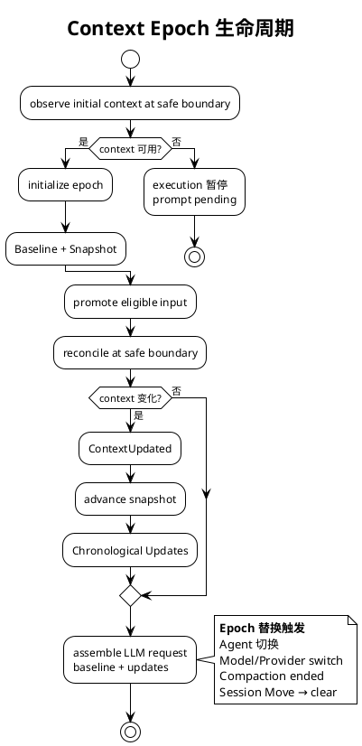

### 14.3 关键设计决策

- **懒采样** —— 上下文变化不会主动 push，只在 Safe Provider-Turn Boundary 采样
- **Stale-while-revalidate** —— 上下文源暂时不可用时保留旧值，不阻塞执行
- **首次初始化阻塞** —— baseline 不完整时不允许启动第一个 provider turn

---

## 15. Compaction

V2 Runner **已实现**自动压缩（`SessionCompaction.compactIfNeeded`）。

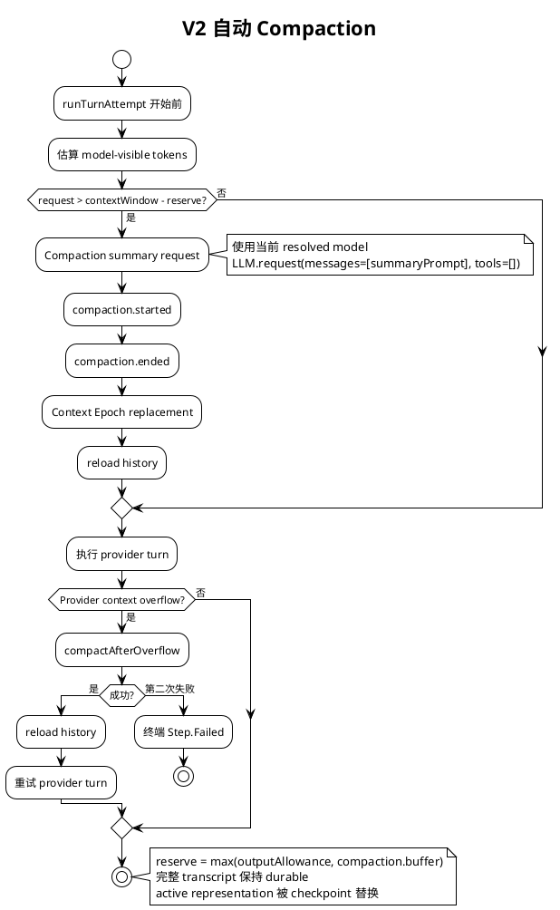

---

## 16. Agent 模型

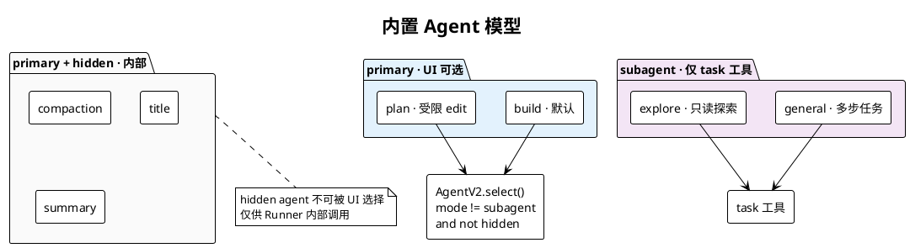

---

## 17. 多 Provider LLM 层

### 17.1 协议与 Provider 的正交组合

`@opencode-ai/llm` 包实现了协议（Protocol）与提供者（Provider）的分离：

```
Providers:   anthropic | openai | google | amazon-bedrock | azure | xai | openrouter | ...
Protocols:   anthropic-messages | openai-chat | openai-responses | bedrock-converse | gemini
```

每个 Provider 选择一个 Protocol 适配器，负责：
- 将统一内部消息格式编码为 Provider 特定的 wire format
- 处理 Provider 特有的 streaming 行为
- 适配不同的错误格式

### 17.2 路由机制

```typescript
// packages/llm/src/provider.ts
export interface Definition<Factory extends AnyModelFactory = ModelFactory> {
  readonly id: ProviderID
  readonly model: Factory          // (id, options?) => Model
  readonly apis?: Record<string, AnyModelFactory>  // 多 API 端点
}
```

### 17.3 Model Request Options 分层

| 层次 | 职责 | 所有者 |
|------|------|--------|
| Generation Controls | provider-neutral 采样参数 | Catalog |
| Model Request Options | provider-semantic 选项 | Session Runner |
| Wire Fields | protocol-specific 编码 | Protocol 适配器独占 |

---

## 18. 插件系统

```typescript
// packages/plugin/src/index.ts
interface Hooks {
  event: (event) => void
  config: (config) => Config
  auth: (provider) => Credentials
  "chat.message": (messages) => Messages
  "chat.params": (params) => Params
  "chat.headers": (headers) => Headers
  "tool.execute.before": (context) => Context
  "tool.execute.after": (result) => Result
  "tool.definition": (definition) => Definition
  "permission.ask": (request) => Decision
  provider: () => ProviderDefinition
}
```

加载流程：项目 `.opencode/plugins/` → `PluginBoot.locationLayer` → 注入到 ToolRegistry / ProviderV2 / Config 等。

---

## 19. 性能与资源管理

| 资源 | 限制 | 管理方式 |
|------|------|---------|
| Location 服务集 | 60 min idle TTL | LayerMap 自动回收 |
| Subagent 并发 | 最多 4 个 | TaskSemaphore |
| Provider Turn | 最多 25 步/drain | MAX_STEPS 硬限制 |
| Tool 输出 | 行数/字节数限制 | ToolOutputStore.bound |
| Context Window | 动态估算 | compactIfNeeded + overflow recovery |

**平台适配：** 通过条件 import（`#sqlite`, `#pty`, `#fff`）实现 Bun/Node 双平台。二进制分发根据 CPU 架构（x64/arm64）和 AVX2 支持选择最优 native binary。

---

## 20. 源码索引

| 主题 | 路径 |
|------|------|
| HTTP 路由组装 | `packages/opencode/src/server/routes/instance/httpapi/server.ts` |
| Instance Session HTTP | `packages/opencode/src/server/routes/instance/httpapi/handlers/session.ts` |
| V2 Session HTTP | `packages/server/src/handlers/session.ts` |
| V1 SessionPrompt | `packages/opencode/src/session/prompt.ts` |
| V1 Processor | `packages/opencode/src/session/processor.ts` |
| V2 Session API | `packages/core/src/session.ts` |
| SessionInput | `packages/core/src/session/input.ts` |
| SessionExecution | `packages/core/src/session/execution/local.ts` |
| RunCoordinator | `packages/core/src/session/run-coordinator.ts` |
| SessionRunner | `packages/core/src/session/runner/llm.ts` |
| EventV2 | `packages/core/src/event.ts` |
| SessionProjector | `packages/core/src/session/projector.ts` |
| EventV2Bridge | `packages/opencode/src/event-v2-bridge.ts` |
| Location layers | `packages/core/src/location-layer.ts` |
| core ToolRegistry | `packages/core/src/tool/registry.ts` |
| TaskTool | `packages/opencode/src/tool/task.ts` |
| V2 规格 | `specs/v2/session.md` |

---

## 21. 架构认知要点

| 常见误解 | 实际情况 |
|---------|---------|
| TUI 已走 `SessionV2.prompt` | TUI 走 `POST /session/{id}/message` → V1 SessionPrompt |
| `@opencode-ai/server` 是独立服务 | 路由包；handlers 挂载在同一 opencode HTTP 进程 |
| EventV2Bridge 是实验功能 | Bridge 始终加载；实验 flag 控制 V1 Processor **额外镜像** |
| V2 不能做 Compaction | Runner 已有 `compactIfNeeded` + overflow recovery |
| Subagent 有独立 Runner | 普通 Session + `task` 工具 + V1 Prompt 循环 |
| Effect 只是错误处理库 | 它是完整的 DI + 资源管理 + 并发框架 |

---

## 22. 演进方向

当前双栈共存是过渡态。V2 Runner 正在逐步达到 V1 parity：

- [x] V2 Compaction（pre-turn check + overflow recovery）
- [x] V2 Tool Settlement（eager fiber + permission assert + output bound）
- [x] V2 Context Epoch（baseline + mid-conversation updates）
- [x] V2 Coordinator（single drain chain + coalesce + interrupt）
- [ ] V2 Subagent（当前仍走 V1 SessionPrompt 循环）
- [ ] V2 TUI/Web 切换（UI 当前仍走 V1 Instance API）
- [ ] V2 多节点执行（durable ownership + remote placement）
- [ ] V2 Plugin lifecycle（热加载 Context Source）

最终目标：V2 Runner 完全替代 V1 `SessionPrompt.loop`，保留 admission/execution 分离 + 单次 `llm.stream`/turn 的架构约束。

---

## 总结

OpenCode 的技术深度体现在以下设计选择：

1. **Effect 类型系统** —— 全栈函数式 DI，编译期保证服务组装正确性，运行时自动管理资源生命周期
2. **事件溯源** —— Session 状态可恢复、可审计、天然支持实时推送，为集群化铺路
3. **双栈渐进迁移** —— 不停服升级架构，V1/V2 通过 EventV2Bridge 共存，UI 无感知切换
4. **Location 隔离** —— 项目级服务容器，`LayerMap` 按需创建 + TTL 自动回收
5. **Context Epoch** —— 持久化系统上下文的一致性管理，懒采样 + stale-while-revalidate
6. **Coordinator 状态机** —— 严格单 drain chain，coalesce 合并重复唤醒，interrupt 安全停止
7. **Admission/Execution 分离** —— 消息录入与执行解耦，crash-safe + 未来可分布式调度

这些设计共同指向一个目标：构建一个**可靠的、可恢复的、可扩展的** AI Agent Runtime，而不仅仅是一个聊天界面。

---

*基于 dev@0f8dec8a4 · opencode@1.17.7 · 2026-06-16*
