# OpenCode 架构图解

> **文档版本 v2026.06.15** · 审查日期 2026-06-15  
> **代码基准** · 分支 `dev` · commit `5d0f866` · 包版本 `opencode@1.17.7`  
> 历史快照：[VERSIONS.md](./VERSIONS.md) · 勘误记录：[versions/2026-06-15/META.md](./versions/2026-06-15/META.md)

本文基于仓库实际代码整理。**Mermaid** 块在 GitHub / Cursor 中可直接预览；**PlantUML** 块需 PlantUML 插件或 [plantuml.com](https://www.plantuml.com/plantuml) 渲染，源文件亦在 [`diagram/`](./diagram/) 目录。

---

## 阅读地图

| 层次 | 章节 | 粒度 | 图表类型 |
|------|------|------|---------|
| 鸟瞰 | §1 心智模型 · §2 系统上下文 | 全局 | Mermaid |
| 结构 | §3 Monorepo · §4 分层 · §5 HTTP 路由 | 模块级 | PlantUML + 表格 |
| 核心 | §6 双执行栈 | 架构决策 | Mermaid + 对照表 |
| 深潜 | §7 V1 路径 · §8 V2 路径 · §9 Coordinator · §10 Provider Turn | 调用链 | PlantUML 时序/活动 |
| 机制 | §11 EventV2 · §12 Location · §13 工具权限 · §14 子 Agent | 子系统 | PlantUML + Mermaid |
| 专题 | §15 Context Epoch · §16 Compaction · §17 Agent | 专题 | Mermaid |
| 索引 | §18 源码 · §19 认知要点 | 查阅 | 表格 |

---

## 1. 心智模型

OpenCode 是 **Bun workspaces monorepo** 开源 AI 编程 Agent。本地运行时核心是 `packages/opencode`（CLI + HTTP）+ `packages/core`（V2 Session 引擎 + SQLite）。

**当前代码态（2026-06-15）的关键事实：** 同一 HTTP Server（默认 `:4096`）上 **并存两套 Session 执行栈 + 两套 HTTP API**。

```
┌─ 交互路径（TUI / Web / Desktop 日常聊天）────────────────────────────┐
│  sdk.client.session.prompt()                                           │
│  → POST /session/{id}/message                                          │
│  → SessionPrompt (V1) → SessionProcessor → LLM (AI SDK)                │
└────────────────────────────────────────────────────────────────────────┘

┌─ Durable 路径（V2 HttpApi / Public API / 演进方向）────────────────────┐
│  client.v2.session.prompt()                                            │
│  → POST /api/session/{id}/prompt                                       │
│  → SessionV2.prompt → SessionInput.admit → SessionExecution.wake       │
│  → SessionRunner → llm.stream → ToolRegistry → EventV2 → SQLite        │
└────────────────────────────────────────────────────────────────────────┘
```

**架构约束（读源码时的锚点）：**

| 约束 | 含义 |
|------|------|
| 准入 ≠ 执行（V2） | `SessionInput.admit` 写 durable inbox；`SessionExecution.wake` 异步调度 |
| 每 Session 一条 drain | `SessionRunCoordinator` 合并 wake、处理 interrupt 边界 |
| 每 turn 一次 LLM（V2） | `SessionRunner.runTurnAttempt` 只调一次 `llm.stream` |
| Location 作用域 | Runner / Tools / Config 按项目目录隔离 |
| 进程全局 | `SessionStore` / `SessionExecution` / `EventV2` 仅按 sessionID 路由 |
| 子 Agent | `task` 工具 + `parentID` 子 Session，非独立 Runner 类型 |

---

## 2. 系统上下文（C4 Context）

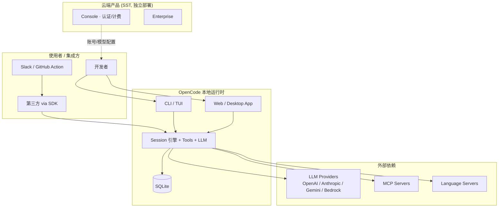

**边界说明：**

- UI 层（`tui` / `app` / `desktop`）**只通过 `@opencode-ai/sdk` 访问 HTTP**，不 import `@opencode-ai/core`。
- `@opencode-ai/server` 是 **路由契约 + handlers 包**，handlers 挂载在 opencode 进程内，不是独立微服务。
- Cloud 包与本地引擎解耦，本地 `opencode serve` 可完全离线运行。

---

## 3. Monorepo 包拓扑

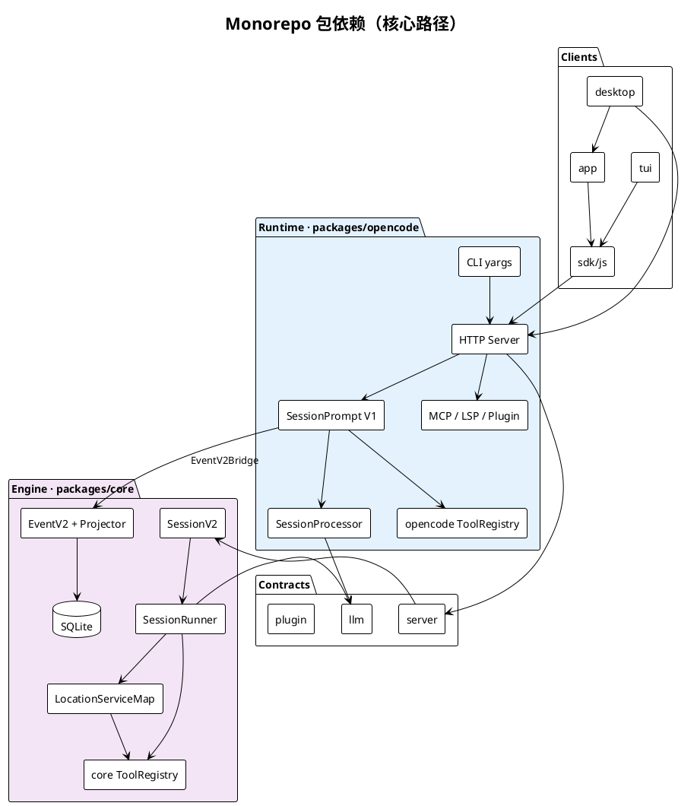

| 包 | 职责 |
|----|------|
| `opencode` | CLI、HTTP Server、Instance Bootstrap、V1 Session 编排 |
| `@opencode-ai/core` | V2 Session、EventV2、Location 层、Drizzle/SQLite |
| `@opencode-ai/server` | HttpApi 路由定义 + V2 handlers（`/api/*`） |
| `@opencode-ai/llm` | Effect Schema LLM 协议、Provider 路由 |
| `@opencode-ai/sdk` | 生成的 HTTP 客户端（Instance + V2 双 surface） |
| `tui` / `app` / `desktop` | UI，SDK-only 边界 |

---

## 4. 运行时分层

七层模型：**由外向内，职责逐层收窄**。

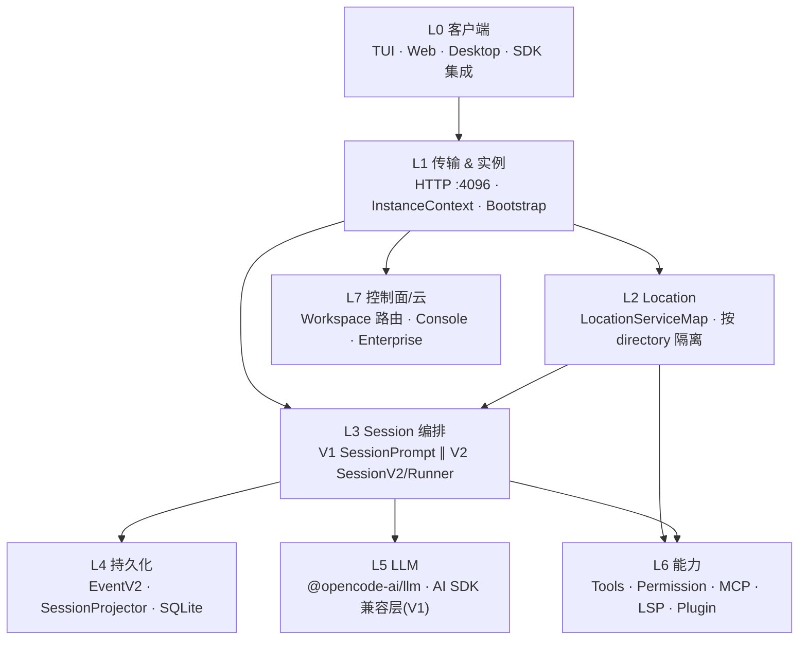

**L1 Instance 层要点：**

- 请求通过 `x-opencode-directory` 或 `?directory=` 绑定项目目录。
- `InstanceBootstrap` 启动：Config、Plugins、LSP、VCS、Snapshot、Format。
- `InstanceState` / `InstanceStore` 按目录缓存服务实例。

**L2 vs L3 作用域分裂（V2 设计核心）：**

| 作用域 | 组件 | 设计意图 |
|--------|------|---------|
| 进程全局 | SessionStore, SessionExecution, EventV2 | 仅持有 sessionID，便于跨 Location 路由 |
| Location | SessionRunner, ToolRegistry, AgentV2, Config | 与 filesystem / 权限 / 工具绑定 |

---

## 5. HTTP Server 路由与实例模型

opencode 在 **单个进程** 内组装多棵路由树（`httpapi/server.ts`）：

| 路由树 | 前缀 | Handler | Session 入口 |
|--------|------|---------|-------------|
| RootHttpApi | `/global/*`, control | global / control-plane | — |
| **InstanceHttpApi** | `/session/*`, `/config/*`, … | `handlers/session.ts` 等 | **SessionPrompt (V1)** |
| **Api (@opencode-ai/server)** | `/api/session/*`, `/api/agent/*`, … | `packages/server/handlers` | **SessionV2** |
| EventApi | SSE | eventHandlers | 事件流 |
| Raw | `/*` UI, Pty WS | uiRoute, ptyConnect | — |

PlantUML 组件视图（源文件 [`diagram/http-server-routes.puml`](./diagram/http-server-routes.puml)）：

```plantuml
@startuml opencode-http-server-routes
!theme plain
skinparam componentStyle rectangle

package "opencode 进程 · 默认 :4096" {
  [HttpApiApp] as app
  package "InstanceHttpApi" { [sessionHandlers\n/session/* → V1] as inst }
  package "Api @opencode-ai/server" { [SessionHandler\n/api/session/* → V2] as v2api }
  package "Raw" { [uiRoute] [PtyConnectApi] }
}
[SDK / TUI / Web] --> app
app --> inst
app --> v2api
note bottom of inst : POST /session/{id}/message
note bottom of v2api : POST /api/session/{id}/prompt
@enduml
```

**SDK 与路由的精确映射：**

| SDK 调用 | HTTP | 执行栈 |
|----------|------|--------|
| `client.session.prompt({ parts, agent, model })` | `POST /session/{id}/message` | V1 |
| `client.session.promptAsync(...)` | `POST /session/{id}/prompt_async` | V1 异步 |
| `client.v2.session.prompt({ prompt, delivery })` | `POST /api/session/{id}/prompt` | V2 |

源码：`packages/sdk/js/src/v2/gen/sdk.gen.ts`（Session2 vs Session3）。

---

## 6. 双执行栈

这是理解整个项目 **_migration 现状_** 的核心章节。

### 6.1 对照表

| 维度 | V1 交互栈 | V2 Durable 栈 |
|------|----------|--------------|
| 入口 | `SessionPrompt.prompt` / `loop` | `SessionV2.prompt` |
| 编排 | `SessionProcessor.process` | `SessionRunner.run` → `runTurnAttempt` |
| LLM | `opencode/session/llm.ts`（AI SDK） | `core/session/runner/llm.ts`（native route） |
| 工具 | `opencode/tool/registry.ts` | `core/tool/registry.ts` |
| 持久化 | MessageV2 + Storage；可选镜像 EventV2 | EventV2 同步事件 → Projector |
| 主要调用方 | TUI、Web 聊天、TaskTool 子 Session | V2 HttpApi、Public API、core 测试 |
| 规格 | 隐含于 opencode 实现 | `specs/v2/session.md` |

### 6.2 汇合点：EventV2 + SQLite

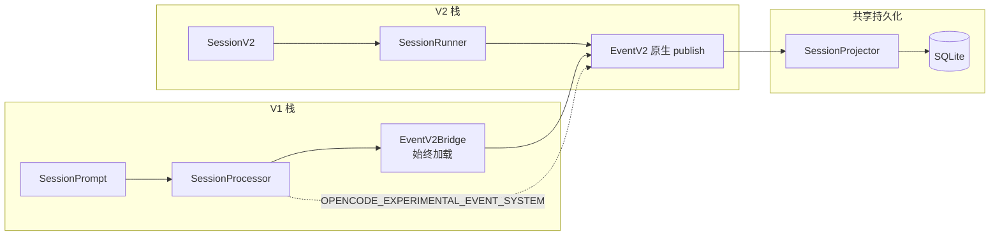

**EventV2Bridge 职责澄清：**

- **始终加载**（`app-runtime.ts`）：为 `EventV2.publish` 自动注入 Instance `location`；转发到 `GlobalBus`。
- **`OPENCODE_EXPERIMENTAL_EVENT_SYSTEM`**：控制 V1 `SessionProcessor` **是否额外镜像** Step/Tool 到 EventV2（`mirrorAssistant`），不是 Bridge 开关。

---

## 7. V1 交互路径（细节）

TUI 发消息的完整调用链：

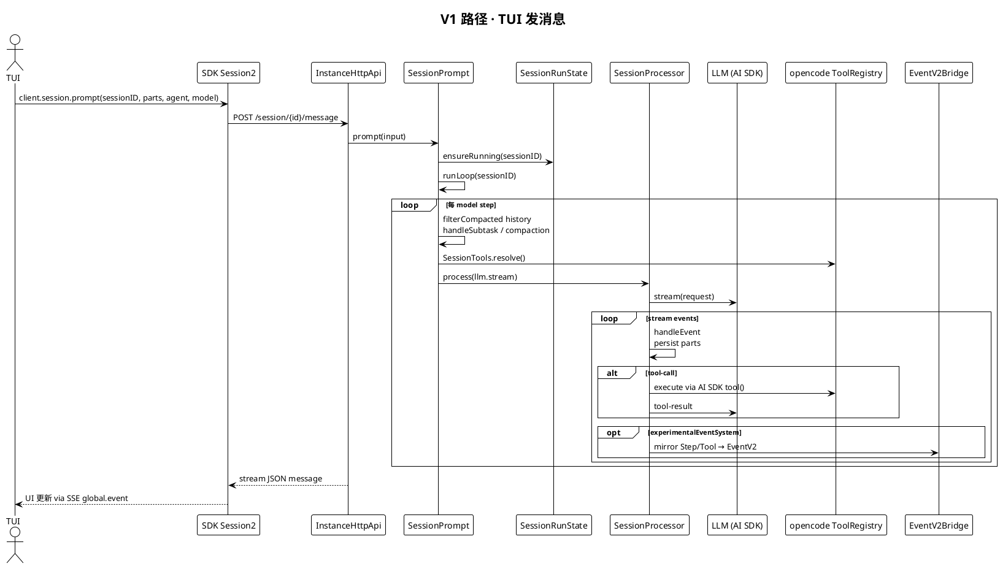

**V1 特征：**

- 内存循环 `SessionPrompt.runLoop`，工具在 Processor 内 inline settle。
- 子 Agent（`task` 工具）对子 Session 递归调用 **同一 V1 路径**。
- Compaction / Revert / Share 等能力仍在 V1 HTTP surface。

---

## 8. V2 Durable 路径（细节）

### 8.1 Prompt 准入 → 调度

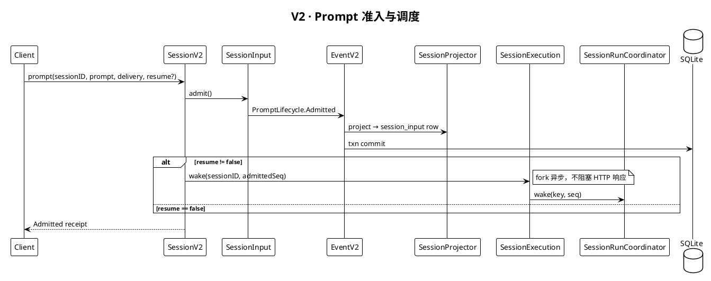

### 8.2 Delivery 语义

| 模式 | 行为 |
|------|------|
| `steer`（默认） | 合并进当前 activity；在下一 **safe provider-turn boundary** 由 Runner `promoteSteers` |
| `queue` | FIFO；当前 activity 结束后 `promoteNextQueued` 开新 activity |

`session_input` 是 durable inbox；**Promoted 之前对模型不可见**。

### 8.3 端到端数据流（Mermaid 总览）

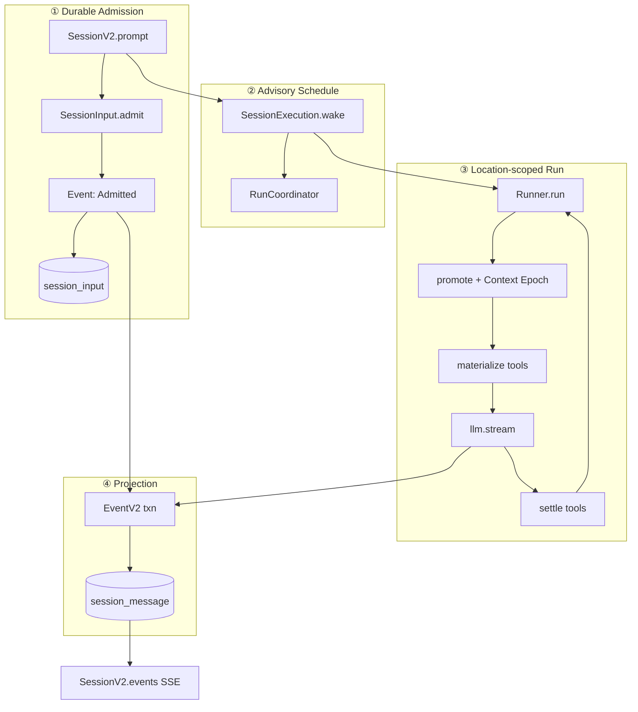

---

## 9. SessionRunCoordinator 状态机

进程内 **每个 Session ID 最多一条 active drain chain**；不同 Session 可并发 drain。

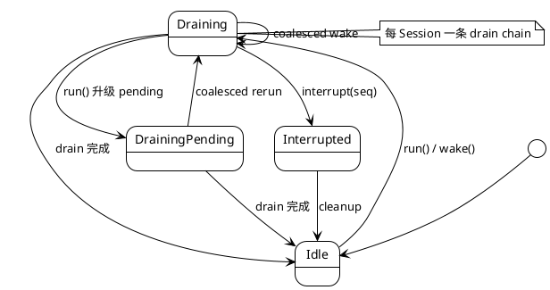

| 操作 | 语义 |
|------|------|
| `run(sessionID)` | 显式 drain；加入当前 chain 或启动新 chain |
| `wake(sessionID, seq?)` | advisory；idle 时启动，draining 时 coalesce 为一次 pending rerun |
| `interrupt(sessionID, seq?)` | 停止 active fiber；suppress interrupt 边界前的 stale wake |
| `resume(sessionID)` | 等价于 force run，处理 durable inbox 中 pending 工作 |

实现：`packages/core/src/session/execution/local.ts` → `SessionRunCoordinator` → `SessionRunner.run({ force? })`。

---

## 10. SessionRunner · 单次 Provider Turn

V2 与 V1 的根本差异：**每 turn 恰好一次 `llm.stream`**，工具在 stream  handler 内 eager fiber settle，turn 结束前 await 全部 fibers。

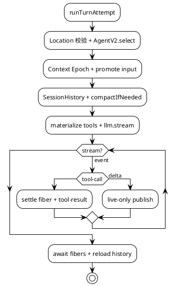

**硬限制与边界行为：**

| 项 | 值 / 行为 |
|----|----------|
| `MAX_STEPS` | 25 provider turns / drain |
| Location 迁移 | Session 已 move 到其他 Location → interrupt |
| 中断工具 | 上次 crash 遗留 `running` 工具 → `Tool execution interrupted` |
| Overflow | `compactAfterOverflow` 最多重建一次 logical turn |

Runner 内待办清单见 `runner/llm.ts` 文件头注释（`[x]` / `[ ]` 跟踪 V2 parity）。

---

## 11. EventV2 事件溯源

### 11.1 两类事件

| 类型 | 持久化 | 投影 | 回放 | 示例 |
|------|--------|------|------|------|
| Sync | ✅ | ✅ DB 事务内 | ✅ | Admitted, Promoted, Tool.Success |
| Live-only | ❌ | ❌ | ❌ | Text.Delta, Reasoning.Delta, Compaction progress |

### 11.2 同步事件提交管道

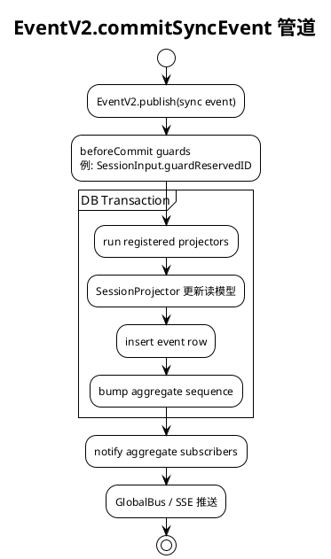

### 11.3 Session 事件词汇（精选）

| 事件 | 投影目标 |
|------|---------|
| `PromptLifecycle.Admitted` | `session_input` inbox row |
| `PromptLifecycle.Promoted` | 可见 user `session_message` |
| `Step.Started/Ended` | assistant turn 边界 |
| `Text.*` / `Reasoning.*` | message parts |
| `Tool.Input/Called/Success/Failed` | tool parts + 状态 |
| `ContextUpdated` | Context Epoch 推进 |
| `Compaction.started/ended` | 压缩 checkpoint |
| `InterruptRequested` | 中断信号 |

读路径：`SessionV2.events({ after })`（SSE）· `SessionHistory.entriesForRunner()`（Runner）。

---

## 12. LocationServiceMap

打开项目目录时 boot 的 Effect Layer 集合（`location-layer.ts`），**Idle TTL 60 分钟**。

```plantuml
@startuml location-services
!theme plain
title LocationServiceMap 服务分层

rectangle "Location.Ref\n{ directory, workspaceID? }" as loc

package "Base" #E0F2F1 {
  [Config] [AgentV2] [PluginV2] [Catalog]
  [FileSystem] [Watcher] [Pty] [SkillV2]
  [SystemContextBuiltIns] [Reference] [CommandV2]
}

package "Permission & Tools" #E8F5E9 {
  [PermissionV2] [PermissionSaved]
  [ToolRegistry] [ToolOutputStore]
}

package "Execution" #F3E5F5 {
  [SessionRunnerModel]
  [SessionRunner]
  [BuiltInTools]
  [SkillGuidance] [ReferenceGuidance]
}

package "Auxiliary" #FFF3E0 {
  [SessionTodo] [QuestionV2]
  [Image] [FileMutation]
}

loc --> Base
Base --> "Permission & Tools"
"Permission & Tools" --> Execution
Base --> Auxiliary

note bottom
  **进程全局（不在 Location 内）**
  SessionStore · SessionExecution · EventV2
  ApplicationTools 注册入口

  Boot 副作用: ProjectCopy.refreshAfterBoot
end note

@enduml
```

**SessionExecution 路由链（仅 sessionID）：**

```
SessionExecution.wake(sessionID)
  → SessionStore.get(sessionID) → location
  → LocationServiceMap.get(location)
  → SessionRunner.run({ sessionID })
```

---

## 13. 工具注册与权限

### 13.1 双 Registry

| | V1 (`opencode`) | V2 (`core`) |
|---|----------------|------------|
| 形态 | AI SDK `tool()` 包装 | `Tool.make` + Effect execute |
| 解析 | `SessionTools.resolve` | `ToolRegistry.materialize` |
| 执行 | Processor inline | `settle()` fiber + `permission.assert` |

### 13.2 V2 工具生命周期

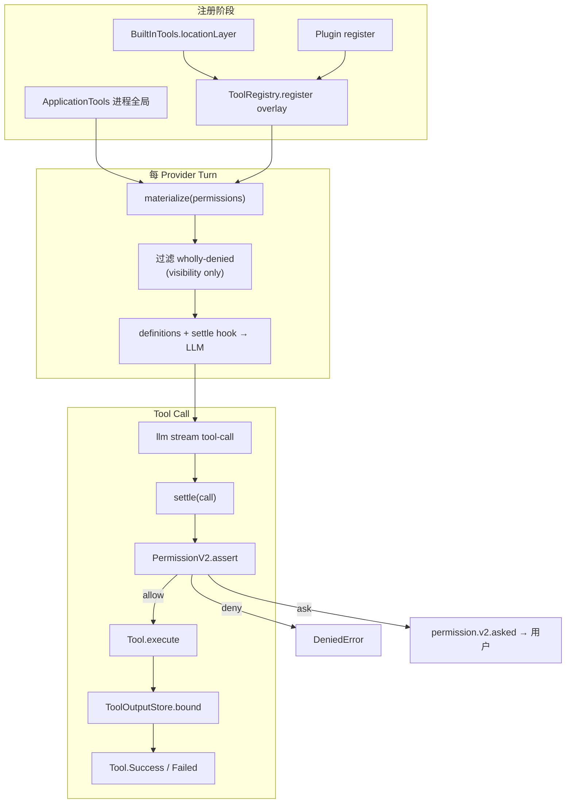

**权限规则合并：** Agent 默认 ruleset + Session `PermissionSaved` + Subagent 继承；**最后匹配的 wildcard 规则胜出**；默认 effect 为 `ask`。

---

## 14. 子 Agent（task 工具）

Subagent **不是**独立 Runner 类型，而是 `parentID` 关联的普通 Session。

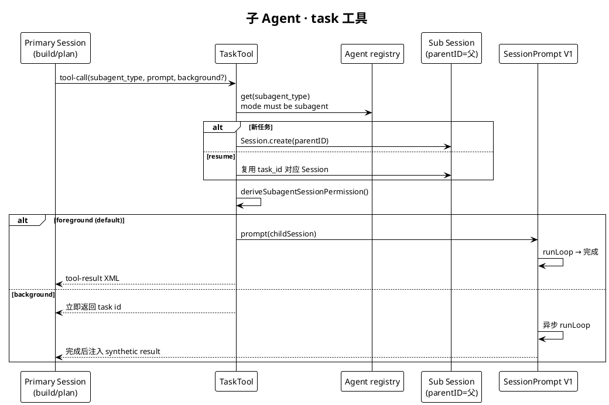

| subagent | mode | 能力概要 |
|----------|------|---------|
| `general` | subagent | 多步研究；deny todowrite |
| `explore` | subagent | 只读探索；deny edit/bash 等 |

源码：`packages/opencode/src/tool/task.ts` · `agent/subagent-permissions.ts`。

---

## 15. Context Epoch

V2 Session 持久化 **模型可见的特权系统上下文**（与 user/assistant 消息分离）。

**Context Sources：** 环境事实 · 主机日期 · `AGENTS.md` · Agent Skills 指引 · Location 注册源

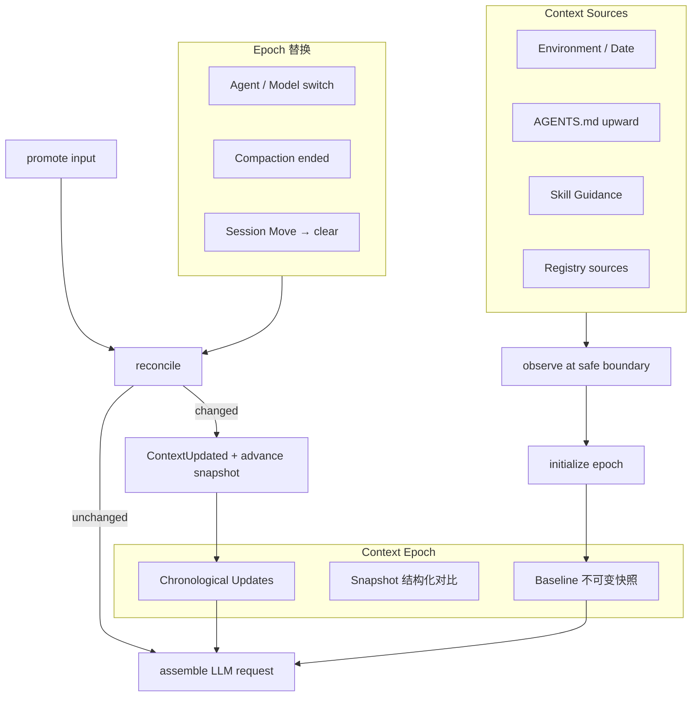

规格：`specs/v2/session.md` · `specs/v2/instructions.md`。

---

## 16. Compaction

V2 Runner **已实现**自动压缩（`SessionCompaction.compactIfNeeded`）。

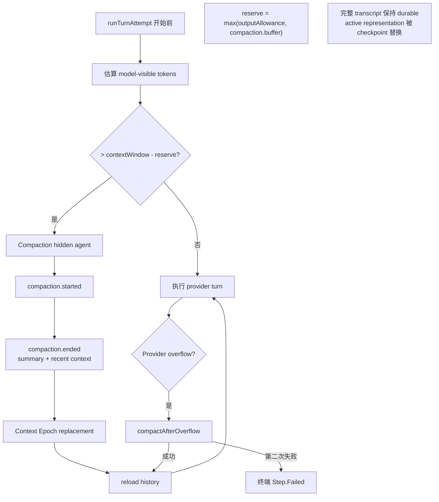

---

## 17. Agent 模型

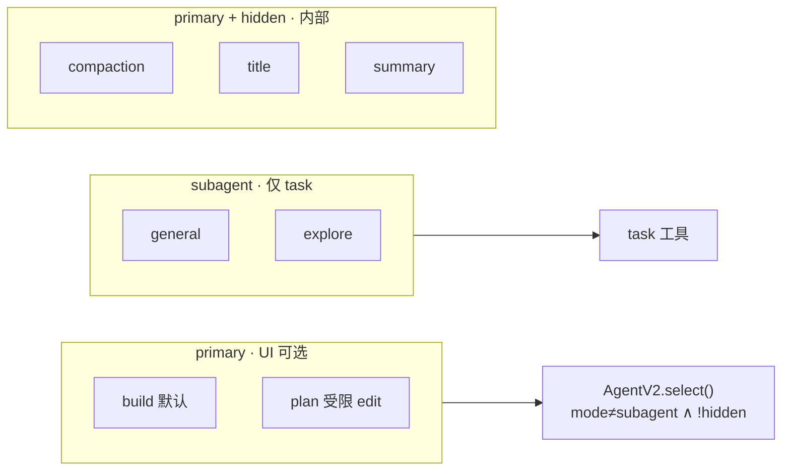

`AgentV2.select(id?)`：`packages/core/src/agent.ts` · 内置定义 `packages/core/src/plugin/agent.ts`。

---

## 18. 源码索引

| 主题 | 路径 |
|------|------|
| HTTP 路由组装 | `packages/opencode/src/server/routes/instance/httpapi/server.ts` |
| Instance Session HTTP | `packages/opencode/src/server/routes/instance/httpapi/handlers/session.ts` |
| V2 Session HTTP | `packages/server/src/handlers/session.ts` |
| SDK Instance prompt | `packages/sdk/js/src/v2/gen/sdk.gen.ts` → `/session/{id}/message` |
| SDK V2 prompt | 同文件 → `/api/session/{id}/prompt` |
| V1 SessionPrompt | `packages/opencode/src/session/prompt.ts` |
| V1 Processor | `packages/opencode/src/session/processor.ts` |
| V2 Session API | `packages/core/src/session.ts` |
| SessionInput | `packages/core/src/session/input.ts` |
| SessionExecution | `packages/core/src/session/execution/local.ts` |
| RunCoordinator | `packages/core/src/session/run-coordinator.ts` |
| SessionRunner | `packages/core/src/session/runner/llm.ts` |
| EventV2 | `packages/core/src/event.ts` |
| SessionProjector | `packages/core/src/session/projector.ts` |
| EventV2Bridge | `packages/opencode/src/event-v2-bridge.ts` |
| Location layers | `packages/core/src/location-layer.ts` |
| core ToolRegistry | `packages/core/src/tool/registry.ts` |
| TaskTool | `packages/opencode/src/tool/task.ts` |
| V2 规格 | `specs/v2/session.md` |

---

## 19. 架构认知要点

读代码或对照本文时，以下结论已与 **dev@5d0f866** 源码核对：

| 常见误解 | 实际情况 |
|---------|---------|
| TUI 已走 `SessionV2.prompt` | TUI 走 `POST /session/{id}/message` → V1 SessionPrompt |
| `@opencode-ai/server` 是独立服务 | 路由包；handlers 挂载在同一 opencode HTTP 进程 |
| EventV2Bridge 是实验功能 | Bridge 始终加载；实验 flag 控制 V1 Processor **额外镜像** |
| V2 不能做 Compaction | Runner 已有 `compactIfNeeded` + overflow recovery |
| Subagent 有独立 Runner | 普通 Session + `task` 工具 + V1 Prompt 循环 |

**演进方向（规格层）：** V2 Runner 完全替代 V1 `SessionPrompt.loop`；保留 admission/execution 分离、一次 `llm.stream`/turn。Parity 进度见 `specs/v2/session.md` 中 V1 Runtime Context Parity 表。

**文档维护：** 架构变更后新建 `versions/YYYY-MM-DD/` 快照，见 [VERSIONS.md](./VERSIONS.md)。

---

*对照 dev@5d0f866 · opencode@1.17.7 · 2026-06-15*
