# OpenCode 架构图解

> **文档版本 v2026.06.15** · 审查日期 2026-06-15  
> **代码基准** · 分支 `dev` · commit `5d0f866` · 包版本 `opencode@1.17.7`  
> 历史快照：[VERSIONS.md](./VERSIONS.md) · 勘误记录：[versions/2026-06-15/META.md](./versions/2026-06-15/META.md)

本文基于仓库实际代码整理。**图表统一使用 PlantUML**，并通过自托管 [Kroki](https://docs.kroki.io/) 生成 SVG。

- **Kroki 服务：** [https://kroki.thetamind.ai/](https://kroki.thetamind.ai/)
- **如何看图：** 每张图下方有 `text` 代码框（Kroki 链接），**复制链接到浏览器打开**即可查看 SVG；同节另有 `plantuml` 代码框为可编辑源码
- **更新链接：** 修改 PlantUML 源码后运行 `python3 liukaining_watch/scripts/embed-kroki-images.py`
- 独立 `.puml` 见 [`diagram/`](./diagram/)

---

## 阅读地图

| 层次 | 章节 | 粒度 | 图表类型 |
|------|------|------|---------|
| 鸟瞰 | §1 心智模型 · §2 系统上下文 | 全局 | PlantUML 组件图 |
| 结构 | §3 Monorepo · §4 分层 · §5 HTTP 路由 | 模块级 | PlantUML + 表格 |
| 核心 | §6 双执行栈 | 架构决策 | PlantUML + 对照表 |
| 深潜 | §7 V1 · §8 V2 · §9 Coordinator · §10 Turn | 调用链 | PlantUML 时序/活动 |
| 机制 | §11 EventV2 · §12 Location · §13 工具 · §14 Subagent | 子系统 | PlantUML |
| 专题 | §15 Context Epoch · §16 Compaction · §17 Agent | 专题 | PlantUML 活动/组件 |
| 索引 | §18 源码 · §19 认知要点 | 查阅 | 表格 |

---

## 1. 心智模型

OpenCode 是 **Bun workspaces monorepo** 开源 AI 编程 Agent。本地运行时核心是 `packages/opencode`（CLI + HTTP）+ `packages/core`（V2 Session 引擎 + SQLite）。

**当前代码态（2026-06-15）的关键事实：** 同一 HTTP Server（默认 `:4096`）上 **并存两套 Session 执行栈 + 两套 HTTP API**。

<!-- kroki:1 ok -->

**图 · 1. 心智模型**

Kroki SVG 链接（复制到浏览器打开）：

```text
https://kroki.thetamind.ai/plantuml/svg/eNptVM9rE0EYve9f8VkvimTTrD-wPZRGktBgxGhiPKiHye6YDNmdXXZmtxXpqR4KCoKI4EVUPBQE6y2Yg4J_S5P2z_CbmU06Sb0s3857-70375vZbSFJKrMohIhyScJSFAc0dC7JIY0oJCFh3BEjxhOSkgj8OEpijsSOfBFSSKkvCR-E1KKIIQniXcYH8JyEgjqSSWRO_xzMPk5mR1-mn17D3zFM376ZfT7EJ1TbTcdJiD8iAwpr0x9fZ4fj0-_Ha0AE-CFDLdEeDeClA_Ck-6gJZXhM-_isUTGScfJM8WTGFFyP-jRAqOeprnD28-D0_dHswy_NyT3Tzdm35OKEch83DDvdbhs6NM1pCps31jduaf2hlMlCvMkxKu5T1fspLwsqBIt52XVd3Z8hXE20D9TfwS_xDXkkYRe4uaeYaETGA4pJp1ph4apXgZPJt5PJu7Px8fT3K20lrygjlxuNxvX6uqajkNmRW7R3kxTHI41CRQQjQ2rf73RhYeEKC66WI3xBpYKpdmmoHUNqL_W5gPlYxWkBo6ZvCK3WPTXZahM6tbsFGoaRBrUdKOHB4KUtW9KUFiLm68JeXaiY0kKMAkZp5-dBLUtJH8-dnaCnE6zfbtysb6wkmHv_DdFbCdGepQ5yiXwhx5630i33lvAmTzLpkiBic4aulzj1PepnUhnbJaNiYp4ql1gPM85pMRIvzbjJylsK_dyfKS1kbkxX1vq5naK2sIUHU1qI0d9X5zsgkvSJwJnUc8wZB3MNOg9aTFI9kqCPVyBjUMLv5vdnfk_1orkoBWRW1D1w9HrB0O_mWLjuFvaETSjU7qQsGFBHW9JsJbhNeYD_O-cfpImpnw==
```

PlantUML 源码：

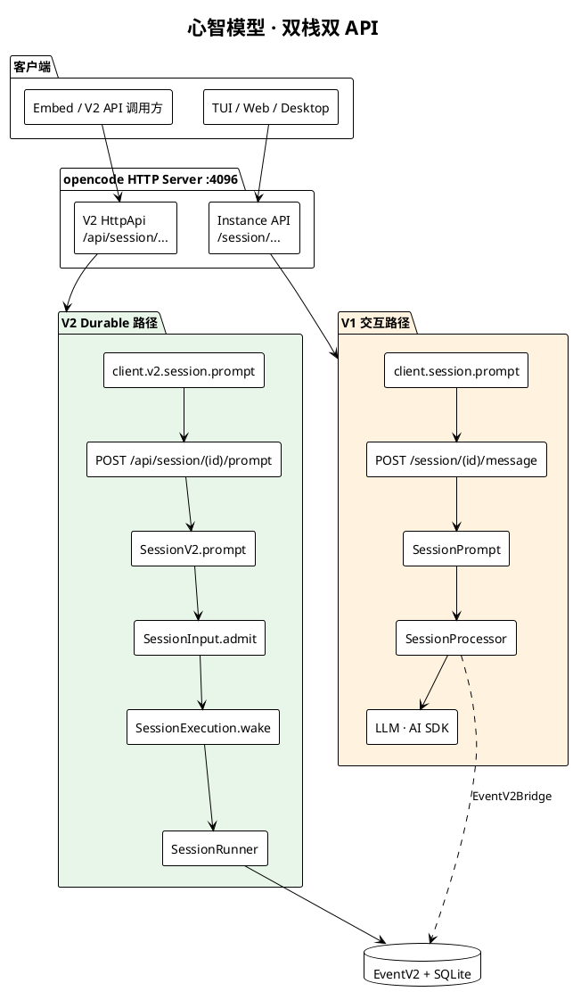


**架构约束（读源码时的锚点）：**

| 约束 | 含义 |
|------|------|
| 准入 ≠ 执行（V2） | `SessionInput.admit` 写 durable inbox；`SessionExecution.wake` 异步调度 |
| 每 Session 一条 drain | `SessionRunCoordinator` 合并 wake、处理 interrupt 边界 |
| 每 turn 一次 LLM（V2） | `SessionRunner.runTurnAttempt` 只调一次 `llm.stream` |
| Location 作用域 | Runner / Tools / Config 按项目目录隔离 |
| 进程全局 | `SessionStore` / `SessionExecution` / `EventV2` 仅按 sessionID 路由 |
| 子 Agent | `task` 工具 + `parentID` 子 Session，非独立 Runner 类型 |

---

## 2. 系统上下文（C4 Context）

<!-- kroki:2 ok -->

**图 · 2. 系统上下文**

Kroki SVG 链接（复制到浏览器打开）：

```text
https://kroki.thetamind.ai/plantuml/svg/eNpVk99rE0EQx9_3rxjTlxZJA-qTD6UxabSYYuUiPqgPm7sxWbK3e9xuUosU2ociWrWWYn0pSkBUMKSCxaY_RPBvySXnf-HuXRJSjmNndr47O_OZu0WlaaibPge1rjT6WVcKjc80uaLr6CMEnDJBVIOJgIbUB1f6gRQotKPXOUKIrqaixnFKourUk2tM1OAp5QqJZtoohz_Ph-ef-r1X_d7O4OAFzBZuQCG9a44Q6moZQia62Ix29-LN7QxQBR62xgGHU7cBObjN9J1mFfKuZlIkoqrUY9Gw0-n3Xg4OTqHFKDjFu4nANkMmdULmXoCiID2EwWEnOvwR_3kXt18PPvxKxFy6lMPM0vXStVIRnhOAR4Xysrm48mD5iRW4nNnNh1g1m0VUDS0DyAdBElzDqg06qJQpD6KL94P9t3AVKlJyZdZyeSXRoagxgUbqUU2rVJmqnPtlpjFtu0o2CHG5bHqQMUdgNZQt5mGoHgtbfN7Wkxe6HsqAuRYK-kwwY9xCL5RuI-2E-5MkK4VVcDBsmRRJzHeDSX5DpUlreCnOVXAJWf9sb_j9qH_2NdrfglnHqcxlUhYmxWqjBjOlvH1GvKRQ0pz6ewJx93N8tJWLu-34-DTFlwatbsnMPgxCpnDERNu2zcwhm11IOI9ti9WMObHtNM2b2ilGI512jXraTZdkx4Cd8iygKdcymY4aBKNiYX5-wX6LcBPi4y_R7klu8K0dfdz5t_1m-LtLyCIKz_xA5D8h9DO-
```

PlantUML 源码：

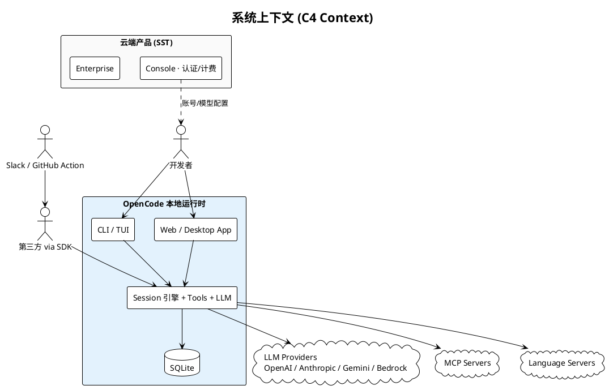


**边界说明：**

- UI 层（`tui` / `app` / `desktop`）**只通过 `@opencode-ai/sdk` 访问 HTTP**，不 import `@opencode-ai/core`。
- `@opencode-ai/server` 是 **路由契约 + handlers 包**，handlers 挂载在 opencode 进程内，不是独立微服务。
- Cloud 包与本地引擎解耦，本地 `opencode serve` 可完全离线运行。

---

## 3. Monorepo 包拓扑

<!-- kroki:3 ok -->

**图 · 3. Monorepo 包拓扑**

Kroki SVG 链接（复制到浏览器打开）：

```text
https://kroki.thetamind.ai/plantuml/svg/eNplU82KE0EQvvdTlPEoIZhlLx5kMZugkEDcCbmIh96eYrY3Pd1Dd2cgiCcVFDx7E3wDT7IelhV8FiN721fY6p_86WW6vqru-uqrqjlxnlu_rBWYBrUwJXYbLha8Qsce-AusERrFpWZuIXXDLa9BmLoxGrUv_EohWBSe60oh89ITnhhtLDYG1p8__Ln5evvjy931x7_ffq5_vbu9-r6-eX93_YmxTAKdgZKUynXgDQN45ZfyNXAHdAbImyZCOgMs0S28Sa5gB58rF71LF11ksrd7qc-W2ksS8PsKNpp6G5UdeDg8GvVHp4l3MH4BK26rlEioyP58NptCgbZFG90X3scyCnROGj211AgP88eJ_J-QIMukdw2hENxww8wYdYaVdN6u4g3jyePCnclgCj0YF-E7VctK6nhBao_VgbihptihNkF9J12jo-Hx6DjpyvXM-6nGtr_npPborMxGM8SGLU1j3odHQBouabRZA7YhOjaCe3oamiIFTniahUr6Av__2sRGW8k9P-eOai9ejqWnUsMYzw9UDYz2lovtPrhd952NJShVJ05VB9jsehTMkIx2B7rdp3EdaHG2dtiYCMI2bUEcKoV3gKa_Ayx8Uwri3wF6Y9tkUlNd8sZBZzuPNLgiDvUyuhtB7nc6Uphe7sHctP0L9B4TI_Usk5DjCeSRPbOyrHCv4LQzKvPnjOwEdUm_O7sHX_lVOg==
```

PlantUML 源码：

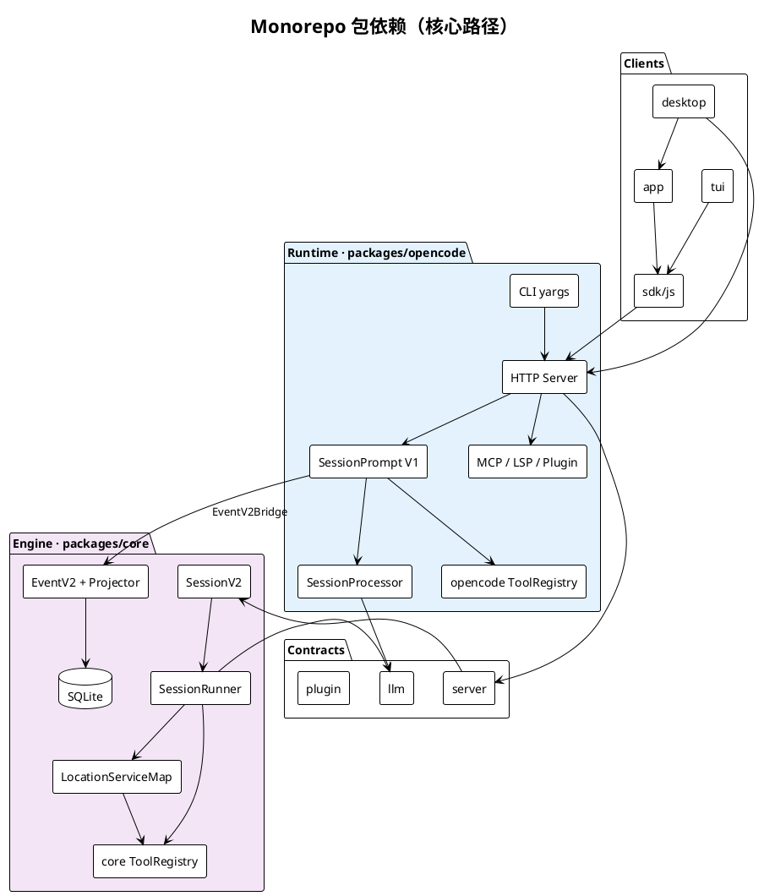


| 包 | 职责 |
|----|------|
| `opencode` | CLI、HTTP Server、Instance Bootstrap、V1 Session 编排 |
| `@opencode-ai/core` | V2 Session、EventV2、Location 层、Drizzle/SQLite |
| `@opencode-ai/server` | HttpApi 路由定义 + V2 handlers（`/api/*`） |
| `@opencode-ai/llm` | Effect Schema LLM 协议、Provider 路由 |
| `@opencode-ai/sdk` | 生成的 HTTP 客户端（Instance + V2 双 surface） |
| `tui` / `app` / `desktop` | UI，SDK-only 边界 |

---

## 4. 运行时分层

七层模型：**由外向内，职责逐层收窄**。

<!-- kroki:4 ok -->

**图 · 4. 运行时分层**

Kroki SVG 链接（复制到浏览器打开）：

```text
https://kroki.thetamind.ai/plantuml/svg/eNpVk89P1EAUx-_zVzwhMXDY7O9d8WDApY3EkqwuLpdehu4II-1MMzOLclQjQSVE0WCi0SgHPZhovEBUxMQ_xewuy3_hmy3b2PTwvn1979P35tvOakOV6UYhqK4wPGK5kG4ypckFs8YiBnFIuSB6nYuYKhpBIKNYCiZMy2yGDBQLDBWrIfuvRK_RjrzLxSrcpqFmxHCDlcPfz4YfdgavDvvbW_1vD2DKK8DfrT3w6tOEGBmDkbAijZERdLjFcikISV8HE1jf_3Iw2D46_fzVF0u3FuDPESyzFRvmmV63DJSt-esTQDVg-aRzyZlzaxlIEXrH74cnL-Ai0t71Tp764trSUhMuVwozNdu_IPBERMAaUhh2z9jUVSmNNorGCbiI4LJbcucz4BJ4MqB2al-MVYupDR6wRTqabLDz-Hw1qTbh7PXL048_E2IJiQUkFjPEMrSY1oiB0-P9we6eL9rFcaqpsNBAPg_t0jjXLuVvdoVgKoGWYdItO1W3moFWcIz7ve-P-jv7vnA2MIkAe2wp985owFHuhscNS2gVpDWcitPI0KrgeYu-mJUxE4HssBzl-TCMbPPcgrUCptrF6YRQRYKLExUyhBoMH_7qP3mDjkoZatvZZCriyeJ4t9ho2uC1RqEZdle5SIA1a7BbdWYywDoMdj_1tw_P3h7kez-e-2JZqnUd04DZfnRVy3AkHfRXxYrr8w3rON-cvQjBbyeXu4JOEzR7pEqpKhO0a6zKiaqkqpo-raW5WtpbJ2SWiQ7-beQfiTE9AA==
```

PlantUML 源码：

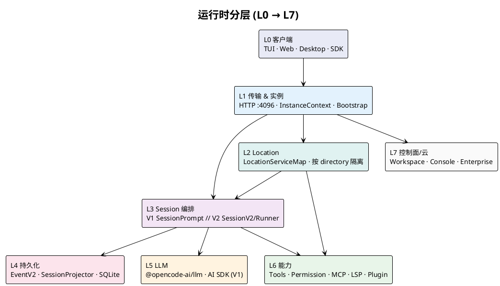


**L1 Instance 层要点：**

- 请求通过 `x-opencode-directory` 或 `?directory=` 绑定项目目录。
- `InstanceBootstrap` 启动：Config、Plugins、LSP、VCS、Snapshot、Format。
- `InstanceState` / `InstanceStore` 按目录缓存服务实例。

**L2 vs L3 作用域分裂（V2 设计核心）：**

| 作用域 | 组件 | 设计意图 |
|--------|------|---------|
| 进程全局 | SessionStore, SessionExecution, EventV2 | 仅持有 sessionID，便于跨 Location 路由 |
| Location | SessionRunner, ToolRegistry, AgentV2, Config | 与 filesystem / 权限 / 工具绑定 |

---

## 5. HTTP Server 路由与实例模型

opencode 在 **单个进程** 内组装多棵路由树（`httpapi/server.ts`）：

| 路由树 | 前缀 | Handler | Session 入口 |
|--------|------|---------|-------------|
| RootHttpApi | `/global/*`, control | global / control-plane | — |
| **InstanceHttpApi** | `/session/*`, `/config/*`, … | `handlers/session.ts` 等 | **SessionPrompt (V1)** |
| **Api (@opencode-ai/server)** | `/api/session/*`, `/api/agent/*`, … | `packages/server/handlers` | **SessionV2** |
| EventApi | SSE | eventHandlers | 事件流 |
| Raw | `/*` UI, Pty WS | uiRoute, ptyConnect | — |

PlantUML 组件视图（源文件 [`diagram/http-server-routes.puml`](./diagram/http-server-routes.puml)）：

<!-- kroki:5 ok -->

**图 · 5. HTTP Server 路由与实例模型**

Kroki SVG 链接（复制到浏览器打开）：

```text
https://kroki.thetamind.ai/plantuml/svg/eNptVLGOEzEQ7f0VQyooooUTQoICJSIHF6HTRbd3uQJd4XgnGyte27KdRBE6CWp-AIToKKhoKSiQ-Bi4-wtmvc7eBijWa8-8efM8M7sDH7gLq0qBsaiFKbC_CMH2Pbo1ur4zq4Ce3QkLrBCs4lIzv5TacscrEKayRqMOedgqBIcicF0q7ED8ghdmI3UJc648Mma5WPISobfLB9c_Pv7-8g5-foOb7--vv36GJw_vP37UA-7BOiPgNQN4dUSihlYOrb2sHdxasrZcp8aEhIhxjs6TZRlDKbhUZsbVEdeFQucjQTI1fmF0cEZNFNe4h0qOBHtxeAZZQYpOSPpwMo6Q-hqUlhBXXUVjTYXVAruqJNk6qjx6L43eS7iztbrmsoQMKmFptWFL61wqvNzRHUsvGiyuqQ87Lsjzw4hprH-LI0EwaPvNZdZ0u9dUVnY05nsauxKnB0nkMZ1r1gyGJSWj98SZtSzQ0fZ5ntolk9I9Had8A6f1hDWpHd90Uq9kdMHNpw-_3ryFC5zBeVPy5Glgk7B9ZrSm0atvRajciCWGCKSCXfiY9IoxLoJx0MtHL0nX2fmYVkLHxEJJUu5ZekO__zROGD1xn8apPadGtuemZrfweA_GtCH5MxOCqcDM2yiA3XAADVE999MHZJyc5DReqbrZ3bQZj-5lVVNhhrqAmvMf5pQfYHoAaeBq2tHK8ZnClptg_-Wnr6yy4ZZ-QDv6I7A_apFitA==
```

PlantUML 源码：

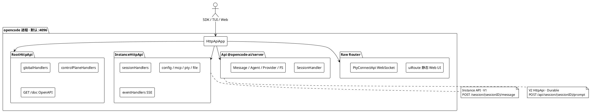


**SDK 与路由的精确映射：**

| SDK 调用 | HTTP | 执行栈 |
|----------|------|--------|
| `client.session.prompt({ parts, agent, model })` | `POST /session/{id}/message` | V1 |
| `client.session.promptAsync(...)` | `POST /session/{id}/prompt_async` | V1 异步 |
| `client.v2.session.prompt({ prompt, delivery })` | `POST /api/session/{id}/prompt` | V2 |

源码：`packages/sdk/js/src/v2/gen/sdk.gen.ts`（Session2 vs Session3）。

---

## 6. 双执行栈

这是理解整个项目 **_migration 现状_** 的核心章节。

### 6.1 对照表

| 维度 | V1 交互栈 | V2 Durable 栈 |
|------|----------|--------------|
| 入口 | `SessionPrompt.prompt` / `loop` | `SessionV2.prompt` |
| 编排 | `SessionProcessor.process` | `SessionRunner.run` → `runTurnAttempt` |
| LLM | `opencode/session/llm.ts`（AI SDK） | `core/session/runner/llm.ts`（native route） |
| 工具 | `opencode/tool/registry.ts` | `core/tool/registry.ts` |
| 持久化 | MessageV2 + Storage；可选镜像 EventV2 | EventV2 同步事件 → Projector |
| 主要调用方 | TUI、Web 聊天、TaskTool 子 Session | V2 HttpApi、Public API、core 测试 |
| 规格 | 隐含于 opencode 实现 | `specs/v2/session.md` |

### 6.2 汇合点：EventV2 + SQLite

<!-- kroki:6 ok -->

**图 · 6.2 汇合点：EventV2 + SQLite**

Kroki SVG 链接（复制到浏览器打开）：

```text
https://kroki.thetamind.ai/plantuml/svg/eNpdks1OFEEQx-_zFCUczaIMMVEPBo09iQkYZDYbDRjSO1POzjLb3enuXWOMB2OIq27Ag3KCgMaEgydORg0Xn4Ve4C2s6Vlw8NT18a-qX1f3vLFc236vgLTPiwZ5yXojkWKAOkORYHDFdrCHoAqei8Cs50JxzXuQyJ6SAoWN7YsCQWNiucgKrElMh6fyeS4yeMYLg4HNLSnd1mj87uD0y2i8PxwfvnUfh_DnB7ABtWqFcBXiRwu5xSBQBMIzhKnWLJB0CriBwSxMR1E0x67DywBgJUZjcimWNMHYp6XCqMvxhCypfUqRVyYno-7pPM1wVbiDDye_h-79_unRkde1fYKURkGjcee8rjy8P8m_qiOG_xBDmGY3oxvs1iXEVljhDcJacLkvBFZw2ps1PHCbeyef9kD120VuOl6Evpp6eI6LksrwsVJRB3Mbh8e_vo9Hr49_brjRtic0VmokyLkojO7_v8cuveP5vrqUSrnlbW6oVfUuvkPaLvfR9RPJpoHVTi4Q_K5mZrwDt4E9XmLLDxbZw-bdhTXWonMtfhI32eKqOPu6675tn33ecW-2ILaorjWlLAKc3JEYgnkUKf3P4C-Lq_PK
```

PlantUML 源码：

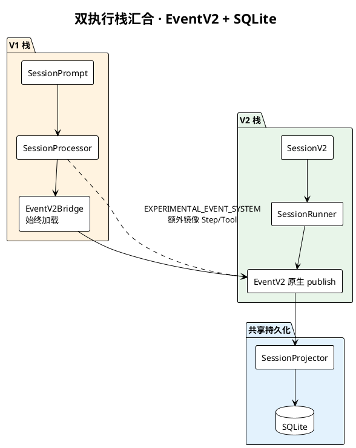


**EventV2Bridge 职责澄清：**

- **始终加载**（`app-runtime.ts`）：为 `EventV2.publish` 自动注入 Instance `location`；转发到 `GlobalBus`。
- **`OPENCODE_EXPERIMENTAL_EVENT_SYSTEM`**：控制 V1 `SessionProcessor` **是否额外镜像** Step/Tool 到 EventV2（`mirrorAssistant`），不是 Bridge 开关。

---

## 7. V1 交互路径（细节）

TUI 发消息的完整调用链：

<!-- kroki:7 ok -->

**图 · 7. V1 交互路径**

Kroki SVG 链接（复制到浏览器打开）：

```text
https://kroki.thetamind.ai/plantuml/svg/eNp1VMFuEzEQvfsrhp4SqUnUHveAWmilBgKN4rSnXtzNkFh4bWN7I3JEQohbBQcufEQ4IHrjwKcgNeIzGNubJqngkMQ7fvPmzczbHPkgXKgrBfODTqhlxzpT2cAehRlWCFYJqVmQQSFcHsCf2-Xdz_fw6xbGF324u_m0-vFx9W7JmCiDcTHILNHJUlqhA-zxk-fA0Xtp9OEeCA8U2EX0NQnQJZ6FYI-tTKCz8Xj4gCdzDJO2TPRvxKjWPIiACTPi_2Mp6WRcAsWnXdhg8AJax_2otZ0gFNhFGIu6NBOEsTFqhFPpg1skaAz4XfDpHHW4PHzi5GSadeUjY3GGncexTgGlkgTr-iyxm7fQah77J_sQOf0-iCnB9qGi6qrN4nyJIQ6sgOE5H0OvSeltctu9io6UyCIuVSR0U0FqW4c2YzxdjHgBqH3tkAappZ5usTSQmOtqPTDGbl8yRQFYLW-yNPABLQPY5LySKqB7SkXJKziBGQ3NuMWVngk9Ucjr6yD8a-hBmSHEe5-fplqsnZSeug69UXNste9RcZOpr7jdllJVl9aCooqIeBcxtMoCcrjl8E2NPjYPkNTnOGBcmKfgJi1TZ6Vpn1faovPUQt5LAgsVIJC2TimUSpENQdMBvsWyDghzKSA7LGWkJrbhSWbiojZrFdI16kn6NTYQEdWXFSkRKgniC5p49YAmG62ASjpHryennfSiEvj94TM0vtyijt_x0_hkbc1mLM_4-UtYOykZL_Z10S-AbLz6-n315Vvqi_NTmCpzLVQ3TZKxIyKlfxj2FwIHfE8=
```

PlantUML 源码：

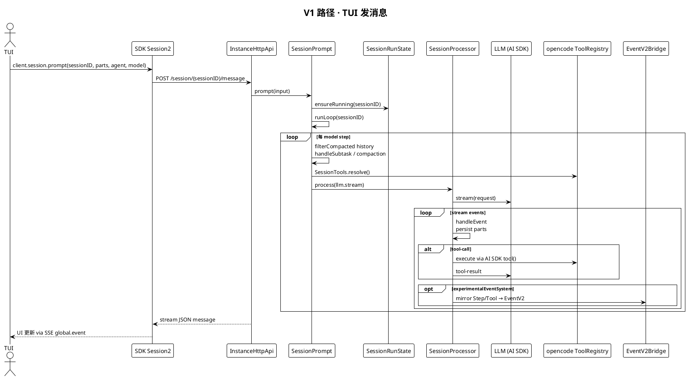


**V1 特征：**

- 内存循环 `SessionPrompt.runLoop`，工具在 Processor 内 inline settle。
- 子 Agent（`task` 工具）对子 Session 递归调用 **同一 V1 路径**。
- Compaction / Revert / Share 等能力仍在 V1 HTTP surface。

---

## 8. V2 Durable 路径（细节）

### 8.1 Prompt 准入 → 调度

<!-- kroki:8 ok -->

**图 · 8.1 Prompt 准入 → 调度**

Kroki SVG 链接（复制到浏览器打开）：

```text
https://kroki.thetamind.ai/plantuml/svg/eNptUjtv1EAQ7vdXTFLlpDPFlRZ5kDtLuSjFgSO3aGPPkeXsXbM7viQtKEmTUAAFFRJF6JDoiJJU_BR0RlDxF7Jr7-UhXWeNv_leOxuGuKaqyGHaC0qtipICnhXCGKEkW6J9LBDKnAvJSFCOkPTg108YNUioT0_q44vZ5fu_P97VV98YKy2ZSEXJJUE_Fyjp0Wg5xoY46S0DNxAnvYW_h7KsqEUMHwOiqaX021GycNlae40pKd2ARtsLQdEhphXZj1YlWgh6Ucm-UjoTks_p4j7LOPE9bhDi5zuC0E0Hm4y1aSFYc6lCaKtcMT7QoOsnXcgwF1PUR13QaKoC1zuM2ZVmcxiCK59WOiweukmUhL7rHTHG9CjN8ckzhyDMWJQ4yGi7UXOZ4ffJB_CSL4UrEbQ68LjBZgh0KCFVhd1njOfkHcDSKox5bpABzJ1EIRzwCT4MwL1ujG86FimVDa_Fq30KYaz0BOqbt3--X_y_OZtdnv_7fF1__QJbu7sjqD-e11efHHfUUPc99QRtB8aRodWee1m99_JQYXZ9DFml-Z49wcZIq-PvDmV29wJPg6B9gnlPljlFUdrIGxZnT53dAus5Ehs=
```

PlantUML 源码：

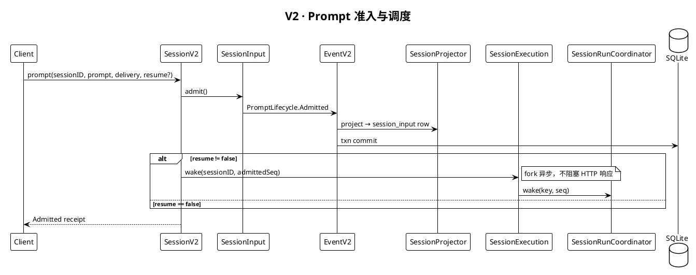


### 8.2 Delivery 语义

| 模式 | 行为 |
|------|------|
| `steer`（默认） | 合并进当前 activity；在下一 **safe provider-turn boundary** 由 Runner `promoteSteers` |
| `queue` | FIFO；当前 activity 结束后 `promoteNextQueued` 开新 activity |

`session_input` 是 durable inbox；**Promoted 之前对模型不可见**。

### 8.3 端到端数据流

<!-- kroki:9 ok -->

**图 · 8.3 端到端数据流**

Kroki SVG 链接（复制到浏览器打开）：

```text
https://kroki.thetamind.ai/plantuml/svg/eNpNUT1PwzAQ3f0rjq0VaoaOVIKikgGJAbVSV2SSgxgcO7IvbUEZYGNBggGJgYEvwYCgXZj6b5Dain-BnaCqi-179947613bEjeUpxIGzUbMiTeOpB6yNUowRcgkF4qRIInQb8LiYzy7mrhzfjeZX3_Nvy8ZK35uH2EnN_zQcbbjVFgrtCpY6cs2eljW_WaQGZ1m1FpCuyrLKeBO4cFwgIpKPRHGDrAV60B4Wquc8-T6A2G1OYNelGCcSyyWduEIo5zcIxjyU3QG3Vx1tDaxUJy0qRyeYU9H3LMaNtIZxuBYBTOYIScG4EUKTWBy1fKl_7MmhHXoaEU4IggzHSVlL-WERnApzhFIa2lLVMo0sGSQp2VpkXx2__1qDgwT4bDa78PFYvq-mH5u1UFYqM3vx3XW2JzdvFWffYF9o08wojLPKiG3BBqplXhSd_NjrBSv0EUeF6upo1dZ6PXClluJzhhro4rdvtkf0ji_HQ==
```

PlantUML 源码：

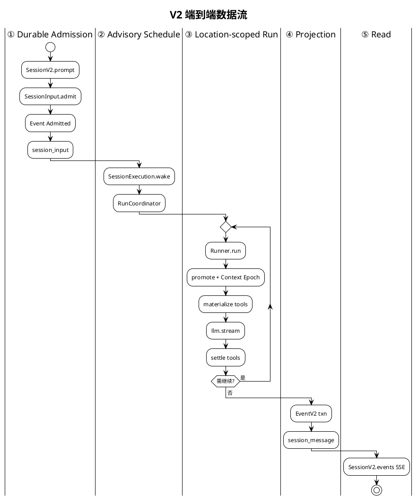


---

## 9. SessionRunCoordinator 状态机

进程内 **每个 Session ID 最多一条 active drain chain**；不同 Session 可并发 drain。

<!-- kroki:10 ok -->

**图 · 9. SessionRunCoordinator 状态机**

Kroki SVG 链接（复制到浏览器打开）：

```text
https://kroki.thetamind.ai/plantuml/svg/eNp9kTFOxDAQRXufYugSpGj7FGgLGjokSkRh2bMbC2fGjB1tSwcFCC5AQUUHLeI8bLgGThZQWC00lmb-8_9fmnlMWlLXeuCAZNhiZZjFOtKJpVrEVu2lBluE4LUjdbp_BlV1AEfWoxqecTqUrDlaQg3SUVHCDFb6HItS_ShbmGHtMRq0I7gbO0ayU9P17dXH2xOEzVptY38mCOb_vyPG5jXYYQfr55v--n6n33_cBqCEIl1IOacG9z0VES9KNRUnbsajpi4o4oQgbtkk4MW0ev9yBycYo2OC99fL_uHxq4FphhvMc8F8MfUJ7v6eEQ==
```

PlantUML 源码：

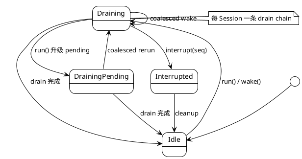


| 操作 | 语义 |
|------|------|
| `run(sessionID)` | 显式 drain；加入当前 chain 或启动新 chain |
| `wake(sessionID, seq?)` | advisory；idle 时启动，draining 时 coalesce 为一次 pending rerun |
| `interrupt(sessionID, seq?)` | 停止 active fiber；suppress interrupt 边界前的 stale wake |
| `resume(sessionID)` | 等价于 force run，处理 durable inbox 中 pending 工作 |

实现：`packages/core/src/session/execution/local.ts` → `SessionRunCoordinator` → `SessionRunner.run({ force? })`。

---

## 10. SessionRunner · 单次 Provider Turn

V2 与 V1 的根本差异：**每 turn 恰好一次 `llm.stream`**，工具在 stream  handler 内 eager fiber settle，turn 结束前 await 全部 fibers。

<!-- kroki:11 ok -->

**图 · 10. SessionRunner · 单次 Provider Turn**

Kroki SVG 链接（复制到浏览器打开）：

```text
https://kroki.thetamind.ai/plantuml/svg/eNotkU1Ow0AMhfdzCrNrhNJFl-mCVggJJMQCEPtpxiGWPD-acVKKegQOAVsOhsQtcBI2Mxr7e8_Pml0Rm2XwDDFhaKPDetzUKceRHOZahhzMhfToERJbCub8hKVQDI9DCJjPMOtNk4fwrOxeBH2SrWnuY2tFOfj5_Pr9_oBL2L9ikJfNuiBjOyHXMQi-Cdyk2PYK6FQfBYFCGqb-_6RbKhLzSYE2-mRbueseEB06RbwVzGSZ3hEkRi5KMft1kYzWb82xJ0ZYLc-rCqjACkfNURkA6mA1ierWMlegWwatAjQFRVTW0QGzGs5MxjKwpgJALmrpkMVWC880Yh0DnyANB6bSz1hw1Bk95wymsUdLsnhOKTNytA76Zbmt0SuZneL6F-YPx7aOjA==
```

PlantUML 源码：

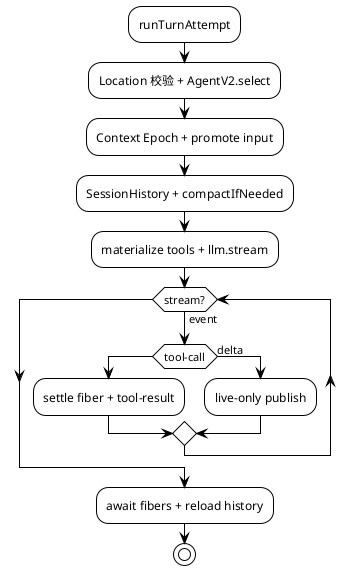


**硬限制与边界行为：**

| 项 | 值 / 行为 |
|----|----------|
| `MAX_STEPS` | 25 provider turns / drain |
| Location 迁移 | Session 已 move 到其他 Location → interrupt |
| 中断工具 | 上次 crash 遗留 `running` 工具 → `Tool execution interrupted` |
| Overflow | `compactAfterOverflow` 最多重建一次 logical turn |

Runner 内待办清单见 `runner/llm.ts` 文件头注释（`[x]` / `[ ]` 跟踪 V2 parity）。

---

## 11. EventV2 事件溯源

### 11.1 两类事件

| 类型 | 持久化 | 投影 | 回放 | 示例 |
|------|--------|------|------|------|
| Sync | ✅ | ✅ DB 事务内 | ✅ | Admitted, Promoted, Tool.Success |
| Live-only | ❌ | ❌ | ❌ | Text.Delta, Reasoning.Delta, Compaction progress |

### 11.2 同步事件提交管道

<!-- kroki:12 ok -->

**图 · 11.2 同步事件提交管道**

Kroki SVG 链接（复制到浏览器打开）：

```text
https://kroki.thetamind.ai/plantuml/svg/eNpNkDFLAzEUx_d8imcnHazQ8W4ptUW6iSdOLrnc6zVyl8TkpVJEsHPBRXARhG6d1MFN8NPoab-FuTsLjvn_f_m95PUdcUu-LABnqGjW2xe6LCWxHZpiiWAKLhUjSQXCqCbOet2WSOZKNAl8P682i3vGGhWLtpjxaSHddNcFsLXvxYxFKU60xcPGAbnnNnPn6vNjGUGCzkmtxsp46jbNCTq0M8zGw3DTBLukAEBnOIBTy5Xjoj534JoBRNYrsJhLR2gxA2P1BQrS1sV1-yc_3qZQPb5VD68_L-_VevX1tGwgqcI8ah8LVl81YepLAzzPg5sTgsNLj0pgzG7Cb5QmOZn_r33qhJUp1nOjo0KnvBh4BweQJCOo7tab20Vc70obxvqosrB79gvOUJLs
```

PlantUML 源码：

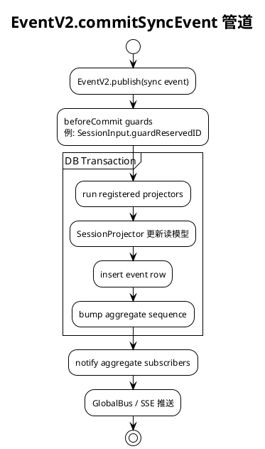


### 11.3 Session 事件词汇（精选）

| 事件 | 投影目标 |
|------|---------|
| `PromptLifecycle.Admitted` | `session_input` inbox row |
| `PromptLifecycle.Promoted` | 可见 user `session_message` |
| `Step.Started/Ended` | assistant turn 边界 |
| `Text.*` / `Reasoning.*` | message parts |
| `Tool.Input/Called/Success/Failed` | tool parts + 状态 |
| `ContextUpdated` | Context Epoch 推进 |
| `Compaction.started/ended` | 压缩 checkpoint |
| `InterruptRequested` | 中断信号 |

读路径：`SessionV2.events({ after })`（SSE）· `SessionHistory.entriesForRunner()`（Runner）。

---

## 12. LocationServiceMap

打开项目目录时 boot 的 Effect Layer 集合（`location-layer.ts`），**Idle TTL 60 分钟**。

<!-- kroki:13 ok -->

**图 · 12. LocationServiceMap**

Kroki SVG 链接（复制到浏览器打开）：

```text
https://kroki.thetamind.ai/plantuml/svg/eNplVE1rFEEQvfevaONFFxNiJKIeNJu4IwsJrtlFD-qhM1Mz225P99jdk-wggggJ8SMIXg2IiLDX4MVDwD_jRD3lL9gfM5MM3qreq66uetXVK0oTqfOUYSZCoqng8wrkNg1BoQt6DCngjBHKkZpQnhFJUhyKNBMcuB7qggGWEGrCEwbnQtSYRGKH8gTHhClAmmoTuV7dMPQXbJAMnxwelG-_lPt75dFrhJpUeK6OXdiE-Am_FFHLCVlcwTtCTlRGQujfvXN5DhNlK0fIIBOSmJOrRIGDt4wxmCT4Ym8xWAqu4hcI48drgsc0eWr5ME4s0k1MKw-XHESsbcEByxPKKzRzjjtNNGGiOu5tCweUwbBQGlLHxMqCj4gOxyAdsuNtl1kXPqkurDucUMaqe5S1HehymVI1TPVqTpnuc-VDChXqqY0xuoAEHoLDJcS-uzQlPKryhWmEXp5TZgAypUoZVbEJwiMhmHJKZYbwSt0Ilns3vVJn0bUMBmgTQ7INUcM5zwbYxJuQUKWl71Xbm2rmfq6z3LwdIaEhDdaqtDeFMLfjd-WB8Vx5wbXecrDsyxuCK2Ez5xzkhoiAuWyptf7jvUbOtFwlqRPAUVsWoFw1E7mX04jU4qoagZbwrRgzgCain5omHEqtVb-QjVy7J-3rrJxW2918ShklsnBtk3zquw5M34utrkciEpV4kbD4gxyUPhvV88q12c124Pn52_U6oHotLFYNHtUPwGKV2q04XwpCXGjAW0JrkWIRN6EYdzp_fn76PXtX7s7Ko1enx_u_fhyUh7Nm5XG5t3t6_KbTMbFVD-4FnLnNyA3U23YraaxuljHqU7hp4ZPvs3Lvfbn7rfzwFbmL-5H5L0aj9VudDr6-iM1f8vfjZ8esCqEtOpDimfk91kRWLJg5SVDjbqxBWh6B2QTbFkIrxjQfIfoHwuPKXg==
```

PlantUML 源码：

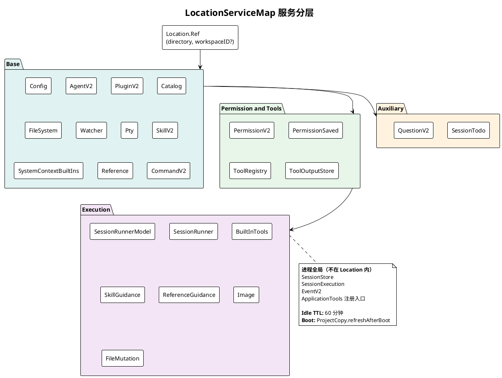


**SessionExecution 路由链（仅 sessionID）：**

```
SessionExecution.wake(sessionID)
  → SessionStore.get(sessionID) → location
  → LocationServiceMap.get(location)
  → SessionRunner.run({ sessionID })
```

---

## 13. 工具注册与权限

### 13.1 双 Registry

| | V1 (`opencode`) | V2 (`core`) |
|---|----------------|------------|
| 形态 | AI SDK `tool()` 包装 | `Tool.make` + Effect execute |
| 解析 | `SessionTools.resolve` | `ToolRegistry.materialize` |
| 执行 | Processor inline | `settle()` fiber + `permission.assert` |

### 13.2 V2 工具生命周期

<!-- kroki:14 ok -->

**图 · 13.2 V2 工具生命周期**

Kroki SVG 链接（复制到浏览器打开）：

```text
https://kroki.thetamind.ai/plantuml/svg/eNpdUk9rE0EUv8-neN42SLfQY3Ow_qkgRAy29D7dfWkeeTuzzMymruTgJdViURAPgqdCxVyMiLQRBPtdxN3Eb-HMLq3Q4_7e7997O1vWSeOKjMFpzWtMA0zKhFHcckPMEHKWpIQjxwh7G1AtPlXTRf19Vh2d_Pnxpj7-vDo9EWLSIn8_XNTz84loPMXmvYLYPVK73tjGrBPpSKueLNF0xWafiwNSYPCArGuQu3nO1JIaCawuPy5nr6vprPr2ws8D-LShmzK-0oEeo2FZdkOJr2-hb_SYUo_vFkZNbogy6RUkmZ5jlKPJyFofZjvefHX5sv55BodDzVyupagIU4jGZGmfmFwZOCkOSFHoZ-E2WHThKEOtR_D76B30eo9DiRAI9yWzD2fOwAejzNrrJh6-uUhrE4WRzxA0gKh_XW1vI5bWonF3OuD_h4LI0_RhRwA0LjE-w6Rw2L0CnhQuL9yO0wbjfV2o9HoS7xRJgtbCOjyUxOgnyBZDnt-2bP0D-UGz-7Yx2rQUH2pHTeT_m8Xj0GyErf_yy3H1a7p8P6tfLZan89X8zCtVSgPhn4LOhdjyX_6NiX8zo_LK
```

PlantUML 源码：

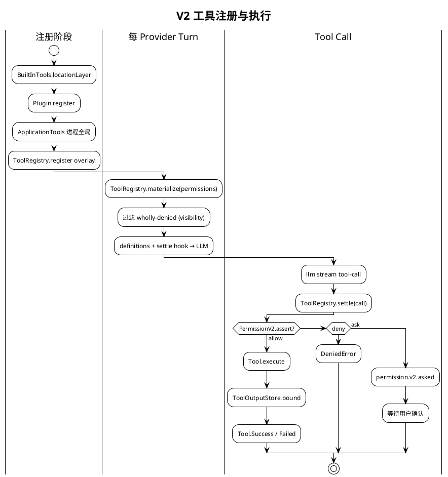


**权限规则合并：** Agent 默认 ruleset + Session `PermissionSaved` + Subagent 继承；**最后匹配的 wildcard 规则胜出**；默认 effect 为 `ask`。

---

## 14. 子 Agent（task 工具）

Subagent **不是**独立 Runner 类型，而是 `parentID` 关联的普通 Session。

<!-- kroki:15 ok -->

**图 · 14. 子 Agent**

Kroki SVG 链接（复制到浏览器打开）：

```text
https://kroki.thetamind.ai/plantuml/svg/eNptU0FrE0EYvc-v-OwpC43iNaA2TZZSTJOlm0oPhWU2O02G7s4uM7NCrkKlqJUgwYsgCAYKUhUKBq0g-FPESfwZzs5kY6Jelt2Z99733pvZLSExl3kSg8hD3CdMViUWJ-iGHJCEQBZjypCkMiagLkdQLxDwfQoFCNR0ok6nCGVagvZohvXehsdpgvkQfCIETdkRq4Q5jaNbWoo5G4AFeJhrlXVWV-t10zQ2gOJjfdvO5aRPheRDAzJL6yg_D1fGZmbMbvPO_OyTHdwYaCN_USzc42mSSXhw2-B8DyFrEqp3jZsaSG2u2sNxXCmLCuQwI5uQGeomhLh30udpzqJ7Dio4BdeYrEGfyHWac8SSNCKQ5EJCSJblI4RjCbOXH39eX6snbxBAqWS818p4N3ucYEmWGR1EYkF0QSJPyL8s9fZ8Pr4whxbQCNSHz-rLuNRChEVo6dimjQinD4m_cFWWRHhCzVvFsUaPU30kJjNUInKM81g6K9N9r7aop9IrjCx0CojvlQCes1aaZvDj8QtQ75_NzkZLBY2wx7Cov4inpx7utWzcP5VrCkulLoD2Bxrd8dx2o9N0A_fQc_d399x2t94KtuuN-zv7nYN2M_APtus7etX_36z5u6fq_OrXt7F69dpedBqtWVZfH80uJ6XzxdaKgI2hRs9nVxfqdAJiyPTvpC8d2AS28S391D8e-g2jkklX
```

PlantUML 源码：

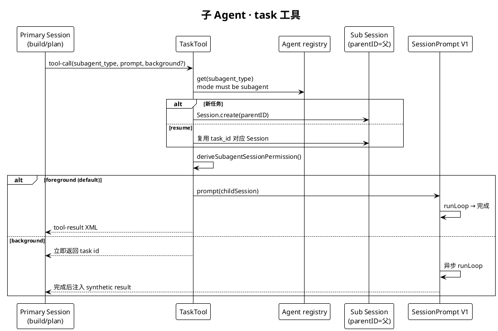


| subagent | mode | 能力概要 |
|----------|------|---------|
| `general` | subagent | 多步研究；deny todowrite |
| `explore` | subagent | 只读探索；deny edit/bash 等 |

源码：`packages/opencode/src/tool/task.ts` · `agent/subagent-permissions.ts`。

---

## 15. Context Epoch

V2 Session 持久化 **模型可见的特权系统上下文**（与 user/assistant 消息分离）。

**Context Sources：** 环境事实 · 主机日期 · `AGENTS.md` · Agent Skills 指引 · Location 注册源

<!-- kroki:16 ok -->

**图 · 15. Context Epoch**

Kroki SVG 链接（复制到浏览器打开）：

```text
https://kroki.thetamind.ai/plantuml/svg/eNqFUrlOAzEQ7f0VQ5cEIfqk4BJdUkV0NN7dya4lr23s2XB0UFCBIAghBJGQKAIdX4D4F6Td8BnYmwMhCsq53nvzZjYdcUtFLiHWivCI1tDoOGMrlGGOYCQXipEgibAza4Dd0ADT26dy9F6OXqvxE2M1CmvryKEdIgglSPAlJnACxwcIkS5Uwu1xhzExgMaiXF69TW9fN5rgSRU0qvu3JgNoz1HECUItqhOS29yhFAphFfqKG5dp6jCUDqFRXk_qOTzCuCChFVQPZ-XpeF8Zq3NDYFAlQqUBx5E2LIQDxtqhrMmzSJGKSAb9pvCwbYteYix85t8N7suLuz8bzC3bMwknTGr9PBlyFSO4pfjQl1mttNSpiL1rs3b3a62FVO4c5kFit9sDiwcFOtpX0Y8pxWKYqbCSFWlGnqLVmp2tevyoLp-_Xibl1ajV8oWtFBXBOvR0ghLcoSB_ffDHzg2PaxM9NSY-1UfnQtzT_sKf5zcQS-Q2KINAFZ7Ae8o2fcL_E_sG7xfewQ==
```

PlantUML 源码：

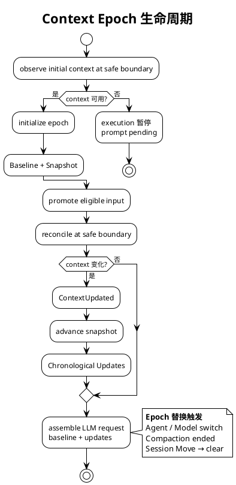


规格：`specs/v2/session.md` · `specs/v2/instructions.md`。

---

## 16. Compaction

V2 Runner **已实现**自动压缩（`SessionCompaction.compactIfNeeded`）。

<!-- kroki:17 ok -->

**图 · 16. Compaction**

Kroki SVG 链接（复制到浏览器打开）：

```text
https://kroki.thetamind.ai/plantuml/svg/eNptks9u00AQxu_7FMMtkUgOHBMBjSq4ggSC89Y7rle1d816nJYbnPqHROqlAglVqBXQqo0akHqCSn2Z2DFvwaxjKEq5rWZnvvl9M7OSkXSUJzEENkllQNqaThjbTXGHIkwQ0lhqI0hTjPDiHlTbZ8XeKaz-TRaiVhA9l5vnuTMDIkxSguLqTXHyrtgd90VvdvVtfvEeEqsw7gx1ptdYjOwGmqwvhA6h5fBVjhnBA8YwhFv0UhtlN6EDDjN0Q3zYBuYx0Co_TNsCoHdDAJFWir_kOhrq-78bK90aDtVyGI1qgquLfvAotUHE3dhvwL4bJYexlYo7ZGTd677AOENoFftf24IldChEr9w9qY5GkDo71AodEA-hcfX0T6wxBXaIzg_3lpsGbRASuidNkgfwKuXOfrH3abnkP3B18Nf2uJoeLOMALMjnk8nsx6icHBWfv1eXXxqh-c-d-fkUnhGm3cdSx4vRALBu6ktrp7et19_CWEJwej0iTm22BfchkVstm1Oa0yBmM9IEePefG-uu5WGIzgMUF6Py4BLISZMFTvPtzK4Py9FbULmTfCmc4mtYlbfjGxiS9d6r43MIIgw2UqsNQfnxuhwfezjwTEKs8JMvW_wGW6MbZA==
```

PlantUML 源码：

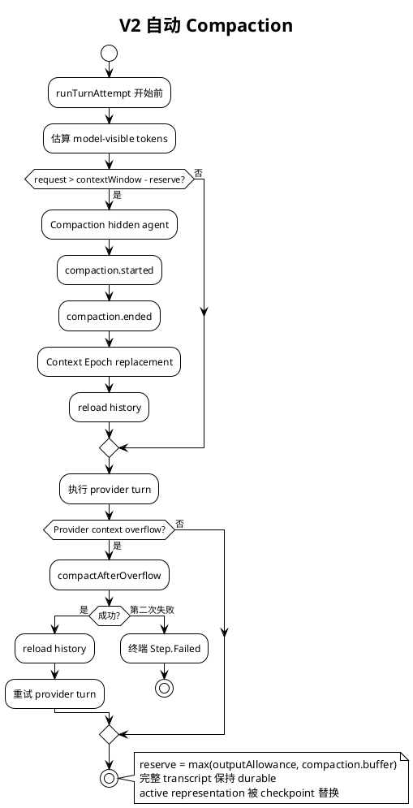


---

## 17. Agent 模型

<!-- kroki:18 ok -->

**图 · 17. Agent 模型**

Kroki SVG 链接（复制到浏览器打开）：

```text
https://kroki.thetamind.ai/plantuml/svg/eNpVUk1rFEEQvfevqMSLIushIUclAbPgLSjmssmhd6ez22xP9zDdgwYJCGEDGjQ5CH6BkCWBVTHxENjAkBzyW3b241_YVT2jK3PpfvWm36tXtWodT10WK-BtoV0tNpFQbMF1RCwgUVxqZrtSJzzlMbRMnBjtac_crhKQipbjuq3EHMV2eGReSN2GHa6sYE46zywOepPrc1hDCRgPTopvh4wlvNX1orCYpDLm6S7cDuH5EyiOLmav3ywCt1AWNrptuLO-XF-qP4ZXDKDRzKSKkD7LP03PT7eRSxgWvWmNteLo4-zzMYhIOiIgzvbmZG3WpJ6RPMp74LjtQjE8K3pDUvd1Uq4vr6_UV4Ky54uUK3r_9Mv419koz4u3JyRQ1pAmXibKpCLY-DG9yMfv-5PLPtHK2n9WqgTuQ0dGkQj-D3qz_QE5CWAws4ZfMIPj4C0njaaHyytWKHUC6YSQzWKU2A6d0RktNGgmm0sPrFB-nHfvbWlcAVh4CFU-W5rrCLRxpY_wBNFZYy60oOfvjIUB1WqPKh4NZe5e5YgQ_VIl9hdgXlBA0zhnYjA7_zLwzZQhhemNrt75lZn2f-Ly-M0ZH373FD_Q0c1XeJppL1RmOf29P_kwYCJ0Ixhb9Ue_-uwPgWsubg==
```

PlantUML 源码：

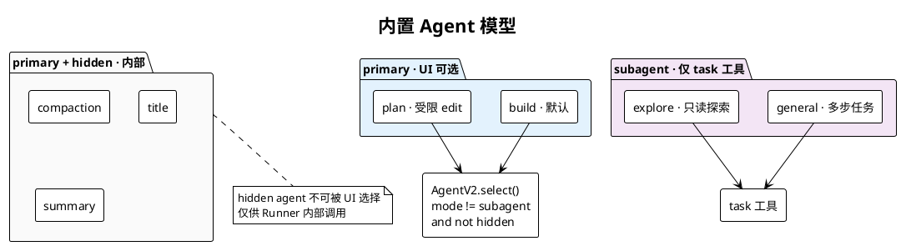


`AgentV2.select(id?)`：`packages/core/src/agent.ts` · 内置定义 `packages/core/src/plugin/agent.ts`。

---

## 18. 源码索引

| 主题 | 路径 |
|------|------|
| HTTP 路由组装 | `packages/opencode/src/server/routes/instance/httpapi/server.ts` |
| Instance Session HTTP | `packages/opencode/src/server/routes/instance/httpapi/handlers/session.ts` |
| V2 Session HTTP | `packages/server/src/handlers/session.ts` |
| SDK Instance prompt | `packages/sdk/js/src/v2/gen/sdk.gen.ts` → `/session/{id}/message` |
| SDK V2 prompt | 同文件 → `/api/session/{id}/prompt` |
| V1 SessionPrompt | `packages/opencode/src/session/prompt.ts` |
| V1 Processor | `packages/opencode/src/session/processor.ts` |
| V2 Session API | `packages/core/src/session.ts` |
| SessionInput | `packages/core/src/session/input.ts` |
| SessionExecution | `packages/core/src/session/execution/local.ts` |
| RunCoordinator | `packages/core/src/session/run-coordinator.ts` |
| SessionRunner | `packages/core/src/session/runner/llm.ts` |
| EventV2 | `packages/core/src/event.ts` |
| SessionProjector | `packages/core/src/session/projector.ts` |
| EventV2Bridge | `packages/opencode/src/event-v2-bridge.ts` |
| Location layers | `packages/core/src/location-layer.ts` |
| core ToolRegistry | `packages/core/src/tool/registry.ts` |
| TaskTool | `packages/opencode/src/tool/task.ts` |
| V2 规格 | `specs/v2/session.md` |

---

## 19. 架构认知要点

读代码或对照本文时，以下结论已与 **dev@5d0f866** 源码核对：

| 常见误解 | 实际情况 |
|---------|---------|
| TUI 已走 `SessionV2.prompt` | TUI 走 `POST /session/{id}/message` → V1 SessionPrompt |
| `@opencode-ai/server` 是独立服务 | 路由包；handlers 挂载在同一 opencode HTTP 进程 |
| EventV2Bridge 是实验功能 | Bridge 始终加载；实验 flag 控制 V1 Processor **额外镜像** |
| V2 不能做 Compaction | Runner 已有 `compactIfNeeded` + overflow recovery |
| Subagent 有独立 Runner | 普通 Session + `task` 工具 + V1 Prompt 循环 |

**演进方向（规格层）：** V2 Runner 完全替代 V1 `SessionPrompt.loop`；保留 admission/execution 分离、一次 `llm.stream`/turn。Parity 进度见 `specs/v2/session.md` 中 V1 Runtime Context Parity 表。

**文档维护：** 架构变更后新建 `versions/YYYY-MM-DD/` 快照，见 [VERSIONS.md](./VERSIONS.md)。

---

*对照 dev@5d0f866 · opencode@1.17.7 · 2026-06-15*
