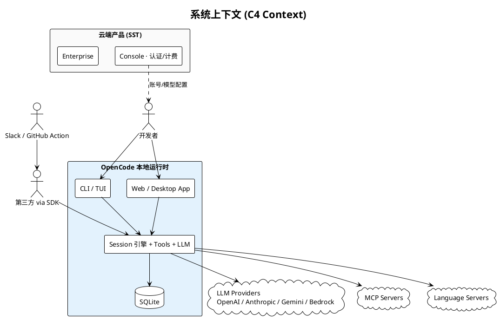
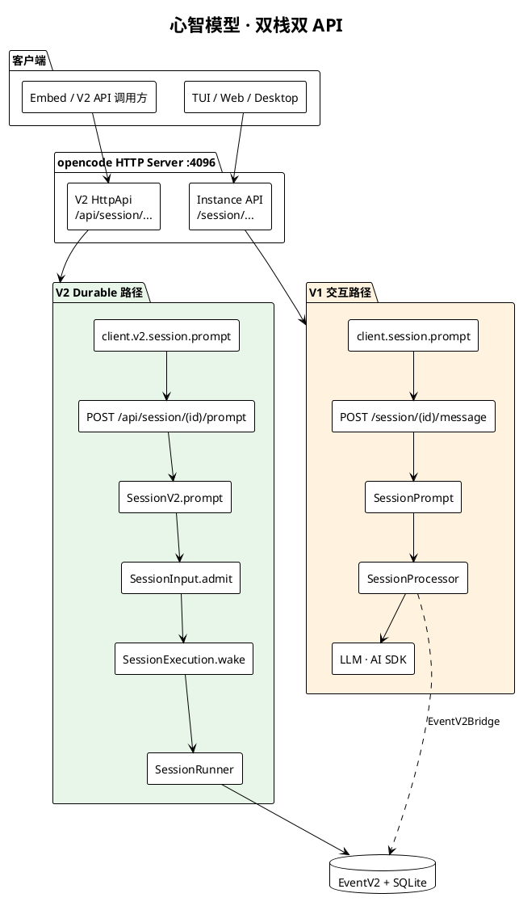
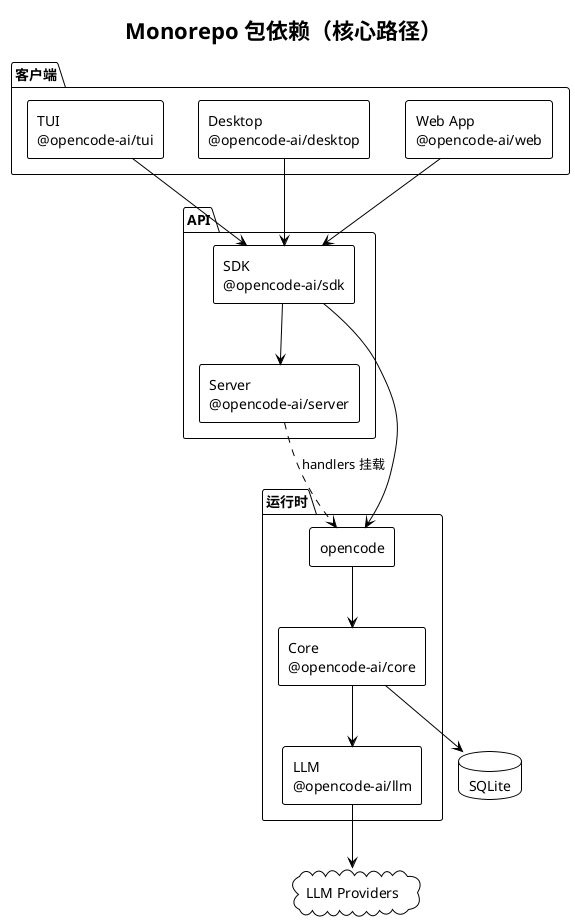
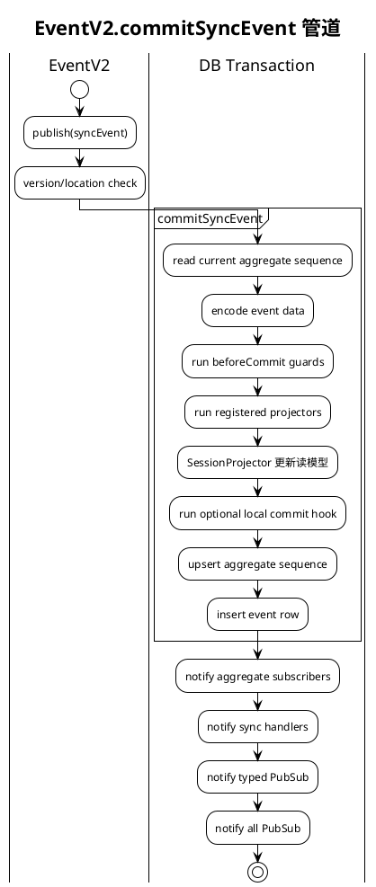
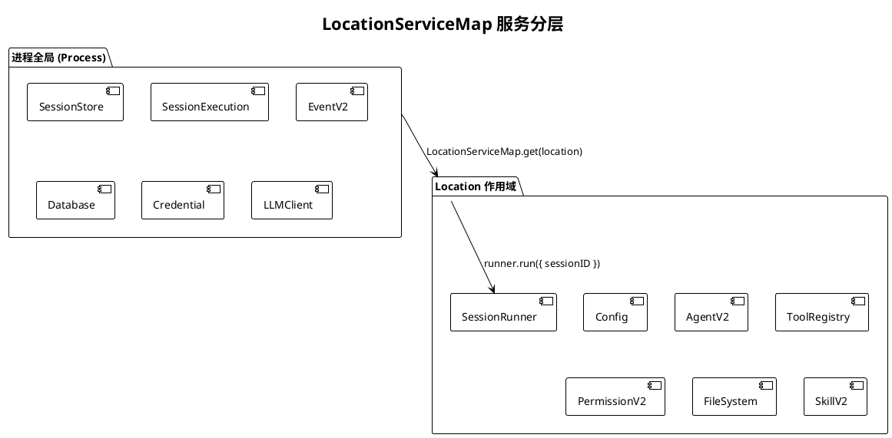
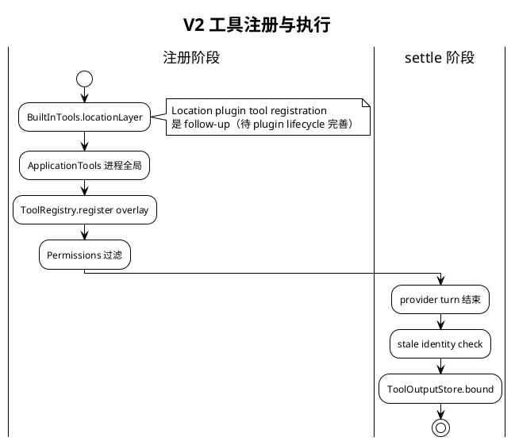
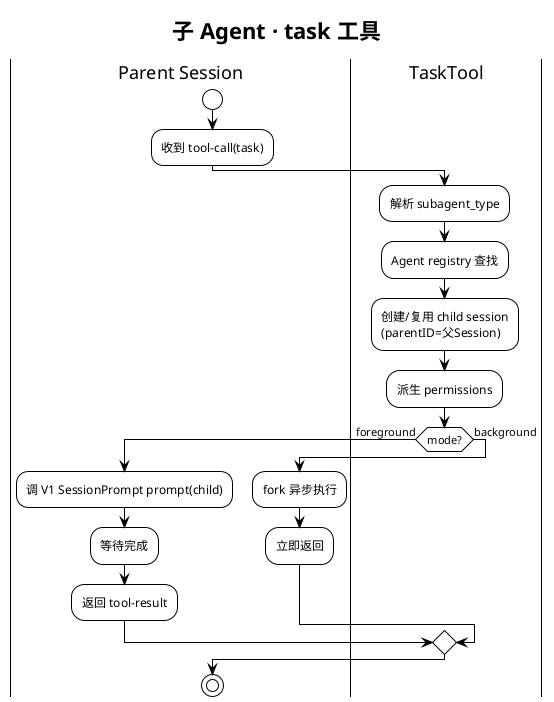
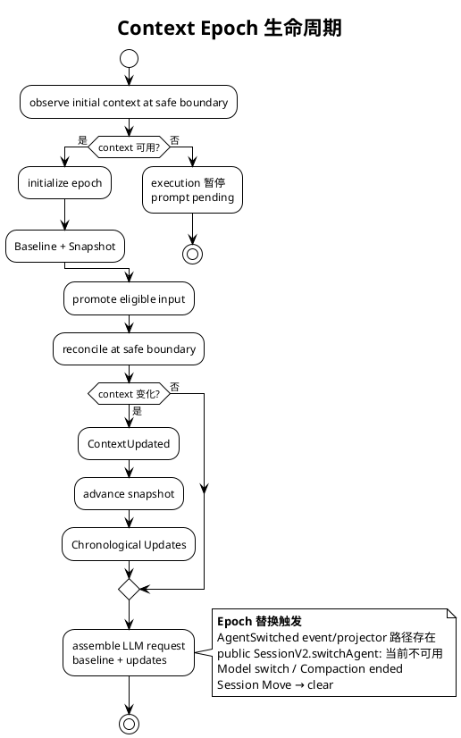
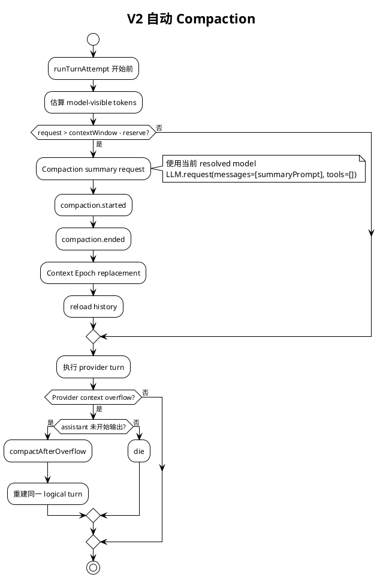
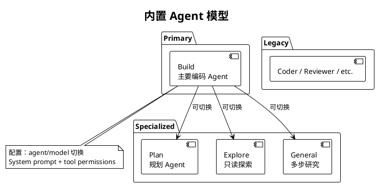

# OpenCode：开源 AI 编程 Agent 架构全解析

> 本文基于 OpenCode v1.17.7 源码（dev@5305247f0）整理，所有架构图通过 PlantUML + Kroki 渲染。

## 什么是 OpenCode？

[OpenCode](https://github.com/sst/opencode) 是一个 **开源 AI 编程 Agent**，采用 Bun workspaces monorepo 架构。它不是一个简单的 CLI 工具，而是一个完整的本地运行时，集成了：

- **多 LLM 提供商**：OpenAI、Anthropic、Gemini、Bedrock 等
- **工具系统**：文件读写、Shell 执行、MCP Server、Language Server
- **多 Agent 协作**：支持子 Agent 并发执行
- **持久化会话**：SQLite 存储 + EventV2 事件溯源

核心设计目标：**让 AI 像开发者一样思考和操作代码**。

---

## 项目全景



OpenCode 的核心是本地运行时，它通过 HTTP Server（默认端口 `:4096`）对外提供服务。TUI、Web App、Desktop App 都通过 SDK 访问这个 HTTP Server，而不是直接 import 核心包。

---

## 核心架构：双栈并存

当前 OpenCode 处于 **V1 → V2 迁移阶段**，同一 HTTP Server 上并存两套执行栈：



### V1 路径（当前 TUI 使用）

```
TUI → SDK client.session.prompt()
  → POST /session/{id}/message
  → SessionPrompt.runLoop（内存循环）
  → SessionProcessor（inline 工具执行）
  → LLM（AI SDK）
```

V1 是传统的同步执行模型，工具在 Processor 内 inline 执行，适合交互式对话。

### V2 路径（Durable Session）

```
client.v2.session.prompt()
  → POST /api/session/{id}/prompt
  → SessionV2.prompt（准入）
  → SessionInput.admit（写 durable inbox）
  → SessionExecution.wake（异步调度）
  → SessionRunner（每 turn 一次 llm.stream）
```

V2 的核心设计是 **准入与执行分离**：
- `admit` 只写持久化 inbox，HTTP 调用立即返回
- `wake` 异步调度执行，支持 wake coalesce 和 interrupt

---

## 包拓扑



| 包 | 职责 |
|---|---|
| `@opencode-ai/core` | V2 Session 引擎、EventV2、SQLite、Location 层 |
| `opencode` | CLI 入口、HTTP Server、V1 Session、Tool 注册 |
| `@opencode-ai/server` | V2 HttpApi 路由定义 + handlers |
| `@opencode-ai/sdk` | 生成的 TypeScript SDK |
| `@opencode-ai/llm` | LLM 提供商抽象层 |
| `@opencode-ai/tui` | 终端 UI（基于 Ink/React） |

---

## HTTP 路由架构

单一 HTTP Server 挂载了四棵路由树：

| 路由树 | 前缀 | 用途 |
|--------|------|------|
| RootHttpApi | `/global/*` | 全局配置、control-plane |
| InstanceHttpApi | `/session/*`, `/config/*` | V1 API（TUI 当前使用） |
| HttpApi (server) | `/api/session/*`, `/api/agent/*` | V2 API（Durable Session） |
| Raw | `/ui`, `/pty` | 静态 UI、WebSocket PTY |

关键路由映射：
- `POST /session/{id}/message` → V1 `SessionPrompt`
- `POST /api/session/{id}/prompt` → V2 `SessionV2`

---

## EventV2：事件溯源核心

EventV2 是 V1/V2 的汇合点，也是持久化和投影的核心。



**事件类型**：
- **Sync（持久化）**：写入 SQLite，可回放，如 `session.next.prompt.admitted`
- **Live-only（流式）**：仅用于实时 SSE/UI，如 text delta

**EventV2Bridge**：始终加载，负责为 opencode 侧的 publish 注入 Location，并转发到 GlobalBus。

---

## Location 作用域

OpenCode 按项目目录隔离服务：



**核心设计**：
- `SessionExecution` 是进程全局路由器，根据 `session.location` 进入对应 Location 层
- `SessionRunner`、`ToolRegistry`、`Config` 等按 Location 隔离
- Location idle TTL = 60 分钟

---

## 工具系统

V2 的工具注册采用 **overlay 模式**：



**工具来源**：
1. `BuiltInTools`：Location 作用域的内置工具
2. `ApplicationTools`：进程全局的工具（如 MCP、LSP）
3. `ToolRegistry.register`：运行时动态注册

**权限模型**：按 Agent 配置过滤，wholly-denied tools 不会出现在 LLM 请求中。

---

## 子 Agent

子 Agent 不是独立的 Runner 类型，而是通过 `task` 工具创建的 **parentID 关联子 Session**：



**子 Agent 类型**：

| 类型 | 模式 | 能力概要 |
|------|------|---------|
| `general-purpose` | subagent | 多步研究；deny todowrite |
| `explore` | subagent | 只读探索；deny edit/bash 等 |

**并发限制**：最多 4 个 subagent 并发执行（`TaskSemaphore`）。

---

## Context Epoch

Context Epoch 负责管理模型可见的特权系统上下文：



**Context 来源**：
- 环境事实（OS、Shell、日期）
- `AGENTS.md` 指引
- Agent Skills
- Location 注册源

---

## 自动 Compaction

V2 Runner 已实现自动压缩，防止 context 溢出：



**触发条件**：
- `config.compaction.auto = true`（默认）
- 估算 token 超过 `context - max(outputAllowance, buffer)`
- 默认 buffer = 20,000 tokens

**Overflow Recovery**：如果 provider 返回 context overflow 且 assistant 未开始输出，可尝试一次 compact + retry。

---

## 内置 Agent

OpenCode 内置多种 Agent，各有不同的 system prompt 和工具权限：



---

## 架构演进方向

OpenCode 正在从 V1 向 V2 迁移，当前状态：

| 维度 | V1 | V2 |
|------|----|----|
| Session 执行 | `SessionPrompt.runLoop`（内存循环） | `SessionRunner`（Durable） |
| 工具执行 | inline settle | fiber settle |
| 事件系统 | EventV1（legacy） | EventV2（同步投影） |
| 状态持久化 | 内存 | SQLite + EventV2 |
| TUI 集成 | 完整 | 进行中 |

**演进目标**：V2 Runner 完全替代 V1 `SessionPrompt.loop`，保留 admission/execution 分离、一次 `llm.stream`/turn。

---

## 总结

OpenCode 的架构设计体现了几个核心理念：

1. **准入与执行分离**：V2 的 admit/wake 模型支持 durable inbox 和异步调度
2. **事件溯源**：EventV2 提供持久化、投影、可回放的事件流
3. **Location 隔离**：按项目目录隔离服务，支持多工作区
4. **工具 overlay**：动态注册 + 权限过滤，支持插件扩展
5. **子 Agent 协作**：通过 parentID 子 Session 实现，而非独立 Runner

这是一个仍在活跃演进的架构，V1/V2 双栈并存是当前的过渡状态，最终目标是统一到 V2 的 durable session 模型。

---

*基于 OpenCode v1.17.7（dev@5305247f0）源码分析*
